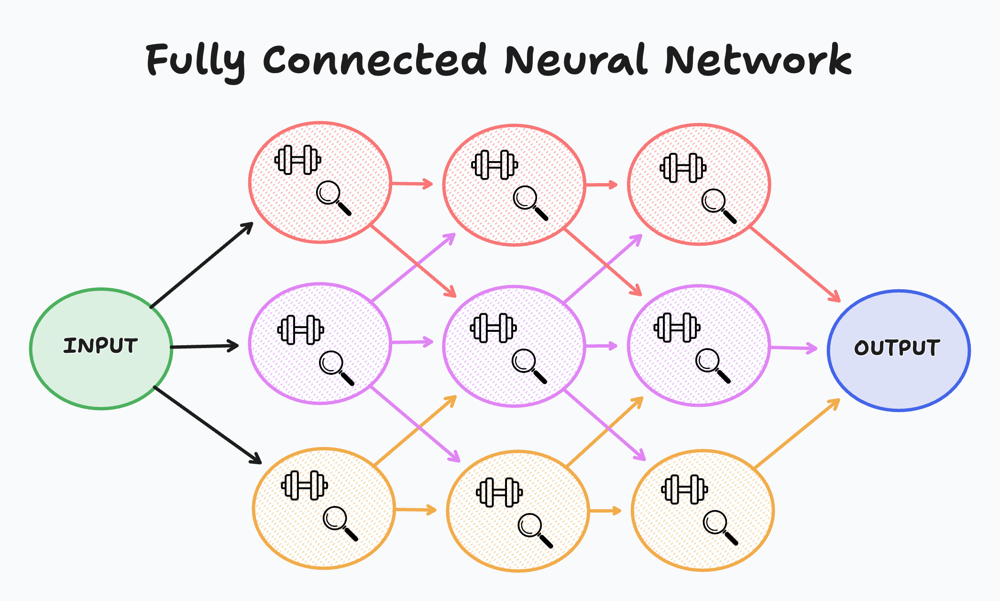
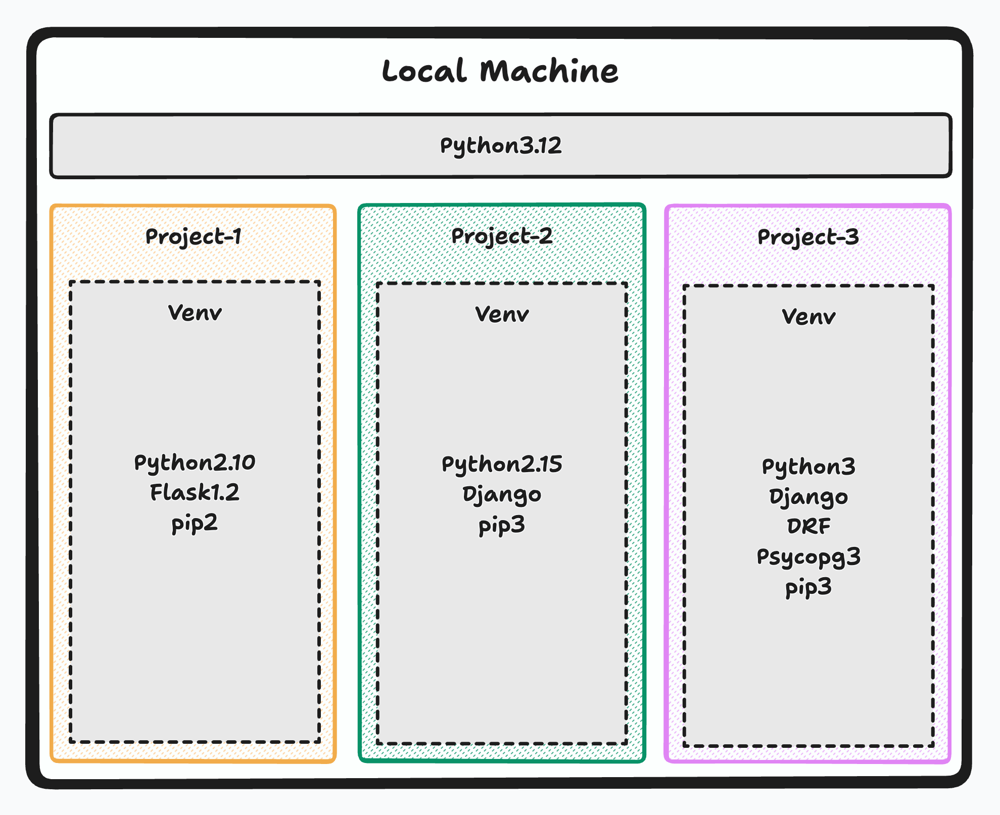

# Introduction to Learning Models

## Introduction

In today's web development landscape, learning models, particularly neural networks, are extensively used in a variety of applications such as natural language processing, image recognition, recommendation systems, and more. These models enable computers to make predictions, understand human language, and recognize patterns in data, leading to more intelligent and responsive applications. By the end of this lecture, you will have a foundational understanding of how neural networks are structured and be able to set up binary and multi-class classification models.

## Lesson Content

### What are Learning Models?

Learning models are algorithms that enable machines to learn from data and make decisions or predictions based on that data. These models range from simple linear regressions to complex neural networks. Neural networks, inspired by the human brain, consist of interconnected nodes (neurons) that process data in layers.

- **Input Layer**: This is where the network receives its input data. Each node in this layer represents a feature of the input data.
- **Linear Layers | Hidden Layers**: These layers, also known as dense or fully connected layers, perform linear transformations on the input data. Each neuron in a linear layer is connected to every neuron in the previous layer.
- **Activation Layers**: After linear transformations, activation functions are applied to introduce non-linearity into the model. Common activation functions include ReLU (Rectified Linear Unit), sigmoid, and tanh.
- **Fully Connected Neural Networks**: These networks have multiple layers of interconnected neurons, allowing them to model complex relationships in data. The output layer provides the final prediction or classification.

Neural networks learn by adjusting the weights of the connections between neurons based on the error of their predictions. This process is called backpropagation and is crucial for the training of the model.



### Python Virtual Environments, what are they? And why do we need them?

A Python virtual environment is an isolated environment that allows you to manage dependencies for different projects separately. This ensures that the packages required for one project do not interfere with those of another. Virtual environments are essential for maintaining clean and manageable project setups, especially when working on multiple projects with different dependencies.



#### Capabilities of Python Virtual Environments

- Isolation of dependencies: Each virtual environment has its own independent set of installed packages.
- Version control: Different projects can use different versions of the same package without conflicts.
- Easy setup and removal: Virtual environments can be created and deleted without affecting the global Python installation.

#### Limitations of Python Virtual Environments

- Resource consumption: Each virtual environment can consume disk space, which can add up if many environments are created.
- Management overhead: Keeping track of multiple virtual environments can become cumbersome.

#### Creating a Python Virtual Environment

Here are the steps to create a Python virtual environment on a Linux terminal:

1. **Install `venv` (if not already installed)**:

    ```bash
    # wsl users only
    sudo apt-get install python3-venv
    ```

2. **Create a virtual environment**:

    ```bash
    python3 -m venv myenv
    ```

3. **Activate the virtual environment**:

    ```bash
    source myenv/bin/activate
    ```

   > You'll see (myenv) on the lower left hand corner of your terminal.

4. **Upgrade your current version of pip**:

   ```bash
     pip install --upgrade pip
   ```

5. **Deactivate the virtual environment**:

    ```bash
    deactivate
    ```

#### Breakdown of Python Virtual Environment Files and Scripts

- `bin/`: Contains the executables for the virtual environment.
  - activate and deactivate bash scripts
  - pip python scripts
  - Python C level COMPILED scripts
- `lib/`: Contains the site-packages directory where all the installed libraries are stored.
- `include/`: Contains C headers that are needed to build Python packages.
- `pyvenv.cfg`: A configuration file for the virtual environment.

### Installing PyTorch

PyTorch is an open-source deep learning framework that provides a flexible and efficient platform for building and training neural networks. It is widely used for both research and production due to its ease of use and dynamic computation graph capabilities.

#### Why Use PyTorch?

- **Ease of use**: PyTorch has a straightforward API that is easy to learn and use.
- **Dynamic computation graph**: Unlike static graphs used by other frameworks, PyTorch allows you to change the graph on the fly, making it more intuitive for debugging and experimentation.
- **Community and ecosystem**: PyTorch has a strong community and a rich ecosystem of tools and libraries.

#### Installing PyTorch in a Python Virtual Environment

1. **Activate your virtual environment**:

    ```bash
    source myenv/bin/activate
    ```

2. **Install PyTorch**:

    ```bash
    pip install torch torchvision torchaudio
    ```

3. **Verify the installation**:

    ```bash
    python -c "import torch; print(torch.__version__)"
    ```

### Installing Jupyter Notebooks in VSCode

Jupyter Notebooks are an open-source web application that allows you to create and share documents containing live code, equations, visualizations, and narrative text. They are widely used in data science and machine learning for exploratory data analysis and prototyping.

#### Why Use Jupyter Notebooks?

- **Interactive coding**: Allows for real-time feedback and visualization of code results.
- **Documentation and visualization**: Combine code with rich text and visualizations for better documentation and presentation.
- **Reproducibility**: Share notebooks with others to reproduce the analysis or experiments.

#### Installing Jupyter Notebooks

1. **Install Jupyter**:

    ```bash
    pip install jupyter
    ```

2. **Install the Jupyter extension in VSCode**:
    - Open VSCode.
    - Go to the Extensions view by clicking the square icon in the sidebar or pressing `Ctrl+Shift+X`.
    - Search for "Jupyter" and install the extension.

3. **Install dependencies for Jupyter Notebooks**:

     JupyterNotebooks does not operate like regular Python files, so it needs a different kernel to manage memory allocations, references, and compile Python code.

    ```bash
    pip install ipykernel
    ```

4. **Connecting a virtual environment to a Jupyter Notebook**:

    - Open a new Jupyter Notebook in VSCode:

      ```bash
       touch <name_of_file>.ipynb
      ```

    - On the upper right hand corner click on select kernel
    - Select `myvenv` as your kernel

5. **Proof that Jupyter Notebook is running with PyTorch installed**:

    - In a new notebook cell, type and run the following code:

        ```python
        import torch
        print(torch.__version__)
        ```

    - If PyTorch is correctly installed, it will print the version number.

### Set-Up Overview

We will see more about the power of Jupyter Notebooks through out this module but for now this will be our stop where we confirm the following:

- Created and understand Python Virtual Environments
- Installed and created a Jupyter Notebook that can execute Python Code.
- Installed Pytorch to start building Learning Models.

## Conclusion

In this lecture, we've introduced the basics of learning models, discussed the importance of Python virtual environments, and walked through the installation of PyTorch and Jupyter Notebooks in VSCode. By understanding these foundational concepts and tools, you are now ready to start building and experimenting with neural networks. Keep practicing, and soon you'll be able to create complex models for various applications. Happy coding!
