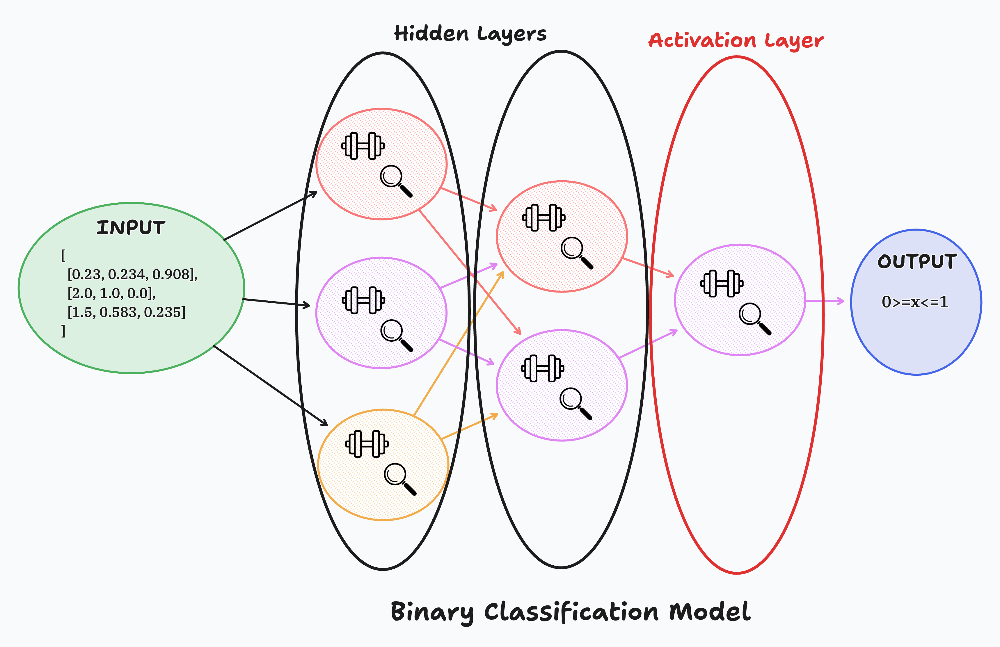
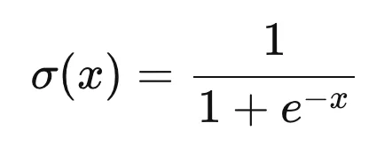

# Building a Binary Learning Model

## Introduction

Binary learning models are a fundamental type of machine learning model used to classify data into one of two categories. Understanding how to build a binary learning model is a crucial step in extending your knowledge of learning models and neural networks. This lesson will guide you through the process of constructing a simple binary learning model using PyTorch.

## Lecture Content

### What is a Binary Learning Model

A binary learning model is designed to classify input data into one of two categories. Examples of binary classification problems include email spam detection (spam or not spam), medical diagnosis (disease or no disease), and binary sentiment analysis (positive or negative). Binary learning models are widely used in software engineering projects for their simplicity and effectiveness in solving many practical problems.

### Neural Network Overview

Neural networks are composed of layers that process input data to produce an output. Here is a brief overview of the layers in a neural network:



- **Input Layer**: This layer receives the input data.
- **Hidden Layers**: These layers process the input data through weighted connections and apply an activation function. Hidden layers are where the model learns to recognize patterns in the data.
- **Activation Layers**: These layers apply a non-linear function to the data, allowing the network to learn complex patterns.
- **Output Layer**: This layer produces the final output, which in a binary model is typically a value between 0 and 1, indicating the probability of the input belonging to one of the two categories.

### Building a Binary Model

#### Importing Necessary Libraries

```python
import torch
import torch.nn as nn
```

#### What is `torch.nn`?

`torch.nn` is a module in PyTorch that provides classes and functions to build neural networks. It includes layers, loss functions, and other tools necessary for building and training models.

#### Building the Model

Let's build a simple binary classification model using linear layers and the sigmoid activation function.

#### NN Tools Breakdown

- **`nn.Linear`**: This layer applies a linear transformation to the input data. It is defined as `nn.Linear(in_features, out_features)`, where `in_features` is the number of input features and `out_features` is the number of output features. It has parameters (weights and biases) that are learned during training.
  - **Capabilities**: Linear transformation of input data.
  - **Limitations**: Cannot capture non-linear relationships in the data.
  - **Weaknesses**: Limited in modeling complex patterns without activation functions.
  - **Type**: It is a hidden layer when placed between input and output layers.
  - **Data Transfer**: It transforms data through a weighted sum and adds a bias.

- **`nn.Sigmoid`**: The sigmoid activation function maps input values to a range between 0 and 1. It is defined as `nn.Sigmoid()`.
  - **Why Sigmoid?**: It is used for binary classification as it outputs a probability value.
  - **Function**: It introduces non-linearity, allowing the network to learn complex patterns.



```python
# Define the model using nn.Sequential
model = nn.Sequential(
  nn.Linear(3,2), # Input layer to Hidden Layer
  nn.Linear(2,1), # Hidden layer to Output layer
  nn.Sigmoid()  # Activation Layer
)
```

#### Why `nn.Sequential`?

`nn.Sequential` is a container module that sequences a series of layers in a linear stack. It simplifies the model-building process by allowing you to define the forward pass of the network in a straightforward manner.

- **Capabilities**: Easy to define and stack layers sequentially.
- **Limitations**: Less flexible for complex models with branching or skipping connections.

#### Utilizing the Sequential Model

We've created a our first Learning Model but have not talked about how to feed data into this model. You'll notice the initial `Linear` layer takes in 3 neurons|nodes but what does that mean as far as our tensor shape?

```python
# Acceptable
torch.tensor([
    [1., 1., 1.]
])
torch.tensor([
    [0.1, 0.1, 0.1]
])

torch.tensor([
    [0.1, 0.2, 0.3],
    [0.4, 0.5, 0.6],
    [0.7, 0.8, 0.9],  # each sub-list within the tensor would receive a binary classification
    [1.0, 1.1, 1.2],
    [1.3, 1.4, 1.5]
])

# Unacceptable
torch.tensor([
    [1, 1, 1]
])
torch.tensor([
    [0.1, 0.2, 0.3, 0.4],
    [0.1, 0.2, 0.3, 0.4],
    [0.1, 0.2, 0.3, 0.4]
])
```

> Each sub-list of the tensor must have a length matching the initial value of the Models Input Linear Layer and must be a `float`.

Now lets feed a tensor into our Binary Model:

```python
# Define a tensor for our model
input_tensor = torch.tensor([
    [0.1, 0.2, 0.3]
])

# Ensure the tensor is of type float
input_tensor = input_tensor.float()

# Define the model using nn.Sequential
model = nn.Sequential(
  nn.Linear(3,2), # Input layer to Hidden Layer
  nn.Linear(2,1), # Hidden layer to Output layer
  nn.Sigmoid()  # Activation Layer
)
output = model(input_tensor)
print(output)
```

#### Viewing Weights and Biases

Weights and biases are parameters of the linear layer that are learned during training. You can inspect them as follows:

```python
# View weights and biases
for name, param in model.named_parameters():
    if param.requires_grad:
        print(name, param.data)
```

In a neural network, weights and biases are the learnable parameters that are adjusted during training to minimize the loss function and improve the model's predictions. Here's a breakdown of what they do and how they are applied within your model:

##### Weights

Weights are the parameters that connect neurons between layers. Each weight determines the strength and direction of the relationship between two neurons. In your model:

1. **First Layer Weights (`0.weight`)**:

    ```python
    tensor([[-0.4012, -0.5649,  0.3153],
            [-0.4333,  0.0119, -0.4002]])
    ```

    These weights connect the 3 input features to the 2 neurons in the hidden layer. Each row corresponds to the weights of a neuron in the hidden layer, and each column corresponds to an input feature.

2. **Second Layer Weights (`1.weight`)**:

    ```plaintext
    tensor([[-0.6352, -0.1661]])
    ```

    These weights connect the 2 neurons in the hidden layer to the single output neuron. Each weight corresponds to the connection strength from a hidden layer neuron to the output neuron.

##### Biases

Biases are additional parameters that allow the model to fit the data better by providing an offset. They are added to the weighted sum of inputs before applying the activation function.

1. **First Layer Biases (`0.bias`)**:

    ```plaintext
    tensor([-0.3478, -0.4386])
    ```

    These biases are added to the weighted sum of inputs for each neuron in the hidden layer.

2. **Second Layer Biases (`1.bias`)**:

    ```plaintext
    tensor([0.4511])
    ```

    This bias is added to the weighted sum of inputs for the output neuron.

##### How They Are Applied

When you pass the `input_tensor` through the model, the following steps occur:

###### First Linear Layer

The input tensor `[[0.1, 0.2, 0.3]]` is multiplied by the first layer's weights and then the biases are added.

Mathematically:
```
hidden_layer_output = input_tensor * 0.weight^T + 0.bias
```

This results in:
```
hidden_layer_output = [[0.1, 0.2, 0.3] * [[-0.4012, -0.5649, 0.3153], [-0.4333, 0.0119, -0.4002]]^T] + [-0.3478, -0.4386]
```

###### Second Linear Layer

The output from the hidden layer is multiplied by the second layer's weights and the biases are added.

Mathematically:
```
output = hidden_layer_output * 1.weight^T + 1.bias
```

###### Activation Function

The Sigmoid activation function is applied to the output of the second linear layer to produce the final output.

Mathematically:
```
final_output = sigmoid(output)
```
where `sigmoid(x) = 1 / (1 + e^(-x))`.

###### Example Calculation

Let's compute the output step-by-step with your provided weights and biases:

###### First Layer Calculation

```
hidden_layer_output = [0.1, 0.2, 0.3] * [[-0.4012, -0.5649, 0.3153], [-0.4333, 0.0119, -0.4002]]^T + [-0.3478, -0.4386]
```

Multiplying and adding biases:

```
hidden_layer_output[0] = (0.1 * -0.4012) + (0.2 * -0.5649) + (0.3 * 0.3153) - 0.3478
                      = -0.04012 - 0.11298 + 0.09459 - 0.3478
                      = -0.40631

hidden_layer_output[1] = (0.1 * -0.4333) + (0.2 * 0.0119) + (0.3 * -0.4002) - 0.4386
                      = -0.04333 + 0.00238 - 0.12006 - 0.4386
                      = -0.59961
```

###### Second Layer Calculation

```
output = [-0.40631, -0.59961] * [-0.6352, -0.1661] + [0.4511]
```

Multiplying and adding bias:

```
output = (-0.40631 * -0.6352) + (-0.59961 * -0.1661) + 0.4511
       ≈ 0.25806 + 0.09957 + 0.4511
       ≈ 0.80873
```

###### Sigmoid Activation

```
final_output = sigmoid(0.80873) ≈ 1 / (1 + e^(-0.80873)) ≈ 0.6918
```

So, the final output after passing through your model is approximately 0.6918.

This process illustrates how weights and biases are used to transform the input through each layer, ultimately producing a prediction from the model.

##### Setting Weights and Biases

Although not recommended, there may be a time where you'll need to set your weights and biases manually and PyTorch provides us an easy way to do that with the following command:

```python
  model[0].weight = nn.Parameter(torch.tensor([[-0.5, 0.2, 0.1], [0.4, -0.1, -0.3]]))
```

#### Defining a Model with `nn.Module`

We just went in depth into building our Learning Model utilizing the built in `Sequential` method. It was great, but it has some limitations that we may not be able to work around depending on the model we are building. Let's turn this model into a Python class for more complex models, it is better to define a custom neural network class by extending `nn.Module`.

```python
class BinaryModel(nn.Module):
    def __init__(self):
        super(BinaryModel, self).__init__()
        self.linear1 = nn.Linear(3, 2)
        self.linear2 = nn.Linear(2, 1)
        self.sigmoid = nn.Sigmoid()
    
    def forward(self, x):
        x = self.linear1(x)
        x = self.linear2(x)
        x = self.sigmoid(x)
        return x

# Create an instance of the model
model = BinaryModel()
```

- **`super(BinaryModel, self).__init__()`**: This initializes the parent class `nn.Module`. It is a way to call the constructor of the parent class and ensure that all necessary initialization is done.

### Expand your knowledge

1. **Modify the Model**: Add another `nn.Linear` layer and experiment with different activation functions like `nn.ReLU()`.
2. **Inspect Parameters**: Write code to inspect and print the weights and biases before and after training the model.
3. **Dataset Preparation**: Generate a simple synthetic dataset and pre-process it for training.

### Overview

In this lesson, we covered the basics of binary learning models and how to build them using PyTorch. We discussed the structure of neural networks, including input, hidden, activation, and output layers. We demonstrated building a simple binary classification model using `nn.Sequential` and `nn.Module`, and explored viewing weights and biases.

## Conclusion

Today, we learned how to build a binary learning model, which is a fundamental skill in machine learning. We explored the concepts of neural network layers, activation functions, and model building using PyTorch. Keep practicing and experimenting with different models and datasets to deepen your understanding. You have taken a significant step towards mastering neural networks. Keep up the great work!
