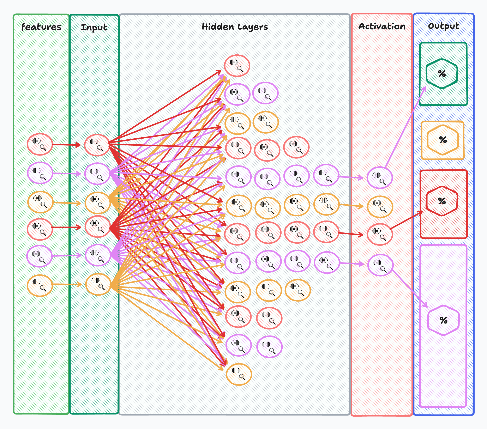

# Multi-Classification Models

## Introduction

In this lecture, we will explore multi-classification models, expanding upon the concepts learned in previous lectures on binary classification models. While binary classification deals with distinguishing between two classes, multi-class classification involves categorizing inputs into more than two classes. This lecture will provide a thorough understanding of the differences, theoretical concepts, and practical implementation of multi-classification models using PyTorch.

## Lecture

### Difference of Multi and Binary Classification

Binary and multi-class classification models serve distinct purposes. Here's a detailed comparison of their functionalities and applications:

| Aspect                       | Binary Classification                             | Multi-class Classification                       |
|------------------------------|--------------------------------------------------|--------------------------------------------------|
| **Classes**                  | Two classes (e.g., 0 and 1)                      | More than two classes (e.g., 0, 1, 2, 3, 4)      |
| **Output Layer**             | Single neuron                                    | Multiple neurons (equal to the number of classes)|
| **Activation Function**      | Sigmoid                                          | Softmax                                          |
| **Loss Function**            | Binary Cross-Entropy (BCELoss)                   | Cross-Entropy Loss (CrossEntropyLoss)            |
| **Example Applications**     | Spam detection, binary sentiment analysis        | Image recognition, labeling performance|

### Model Structure

The structure of neural networks for both binary and multi-class classification models is quite similar, with key differences in the output layer and activation functions.

- **Model Structure**
  - **Input Layer:** Same for both binary and multi-class models, corresponding to the number of features.
  - **Hidden Layers:** Same for both, consisting of linear layers and activation functions.
  - **Activation Layer:** Different; sigmoid for binary and softmax for multi-class models.



#### What is Softmax

Softmax is an activation function used in the output layer of a neural network for multi-class classification. It converts raw output scores (logits) into probabilities, ensuring that the sum of probabilities for all classes is 1.

**Analogy:** Think of Softmax as a normalizer that turns a list of exam scores into a percentage distribution. If a student scores 50, 75, and 100 in three subjects, Softmax converts these scores into relative percentages like 20%, 30%, and 50%, making it easier to compare.

##### Sigmoid vs Softmax

| Feature              | Sigmoid                                       | Softmax                                       |
|----------------------|-----------------------------------------------|-----------------------------------------------|
| **Output Range**     | 0 to 1                                        | 0 to 1 (sum of all outputs = 1)               |
| **Use Case**         | Binary classification                         | Multi-class classification                    |
| **Activation**       | Applies element-wise                          | Applies to the entire output vector           |
| **Probability Interpretation** | Each output independently interpreted as a probability | Outputs interpreted as probabilities summing to 1 |

### Pre-Processing Data

#### Labels as Long types?

In multi-class classification, labels should be represented as integer types (typically `Long` in PyTorch) rather than floating-point numbers. This is because classification tasks require discrete class labels, and loss functions like `CrossEntropyLoss` expect integer labels. Floating-point representations can lead to incorrect computations and errors during training.

### Training Tools

#### Cross Entropy Loss

Cross Entropy Loss is a common loss function for multi-class classification. It measures the performance of a classification model whose output is a probability value between 0 and 1. Cross Entropy Loss increases as the predicted probability diverges from the actual label.

**Analogy:** Imagine Cross Entropy Loss as a penalty score in a quiz game. If a contestant's answer (predicted probability) is far from the correct answer (actual label), the penalty is high. The goal is to minimize this penalty to improve accuracy.

##### CrossEntropyLoss vs BCELoss

| Aspect                   | CrossEntropyLoss                               | BCELoss                                        |
|--------------------------|------------------------------------------------|------------------------------------------------|
| **Use Case**             | Multi-class classification                     | Binary classification                          |
| **Input**                | Logits (raw output scores)                     | Probabilities                                  |
| **Label Type**           | Integer labels (class indices)                 | Floating-point labels (0 or 1)                 |
| **Output**               | Single scalar loss value                       | Single scalar loss value                       |

### Building the Model

Let's build a multi-classification model using PyTorch:

```python
import torch
import torch.nn as nn
import torch.nn.functional as F

class MultiModel(nn.Module):
    def __init__(self):
        super(MultiModel, self).__init__()
        self.ly1 = nn.Linear(14, 30)
        self.dp1 = nn.Dropout(p=0.5)
        self.ly2 = nn.Linear(30, 20)
        self.dp2 = nn.Dropout(p=0.5)
        self.ly3 = nn.Linear(20, 15)
        self.dp3 = nn.Dropout(p=0.5)
        self.ly4 = nn.Linear(15, 10)
        self.dp4 = nn.Dropout(p=0.5)
        self.ly5 = nn.Linear(10, 5)
        self.softmax = nn.Softmax(dim=1)  # Correct dimension for softmax

    def forward(self, x):
        x = self.dp1(F.relu(self.ly1(x)))
        x = self.dp2(F.relu(self.ly2(x)))
        x = self.dp3(F.relu(self.ly3(x)))
        x = self.dp4(F.relu(self.ly4(x)))
        x = self.softmax(self.ly5(x))
        return x

# Instantiate the model, define loss function and optimizer
model = MultiModel()
```

#### Explaining Model Predictions

Model predictions in a multi-class classification model are interpreted by finding the class with the highest probability. Here's how you can interpret the predictions:

```python
outputs = model(batch_features)
_, predicted = torch.max(outputs.data, 1)
print(_, predicted)
```

- `outputs`: Raw output from the model, representing class probabilities.
- `torch.max(outputs.data, 1)`: Finds the class index with the highest probability.
- `predicted`: The predicted class for each input sample.

### Training and Evaluating the Model

#### Build the Training Loop

Here's a code sample for the training loop using Adam as the optimizer and CrossEntropyLoss as the criterion:

```python
import torch.optim as optim

# Define loss function and optimizer
criterion = nn.CrossEntropyLoss()
optimizer = optim.Adam(model.parameters(), lr=0.001)

# Training loop
num_epochs = 100
for epoch in range(num_epochs):
    model.train()
    running_loss = 0.0
    for inputs, labels in train_loader:
        optimizer.zero_grad()
        outputs = model(inputs)
        loss = criterion(outputs, labels)
        loss.backward()
        optimizer.step()
        running_loss += loss.item()
    print(f'Epoch [{epoch+1}/{num_epochs}], Loss: {running_loss/len(train_loader)}')
```

#### Build the Evaluation Loop

Here's a code sample for the evaluation loop using `Accuracy` from `torchmetrics`:

```python
from torchmetrics import Accuracy

# Initialize accuracy metric
accuracy = Accuracy(task='multiclass', num_classes=5)

# Evaluation loop
model.eval()
with torch.no_grad():
    for inputs, labels in test_loader:
        outputs = model(inputs)
        _, predicted = torch.max(outputs.data, 1)
        accuracy.update(predicted, labels)

print(f'Accuracy: {accuracy.compute().item()}')
```

### Overview

This lecture covered the fundamentals of multi-classification models, including differences from binary classification, model structure, data preprocessing, training tools, and building and evaluating the model. You should now have a good understanding of how to implement multi-classification models using PyTorch.

## Conclusion

Multi-classification models expand the capabilities of neural networks to handle more complex classification tasks. By understanding the theoretical differences and practical implementations, you can now build and train multi-class models effectively. Practice with the provided examples and explore further to enhance your skills.
