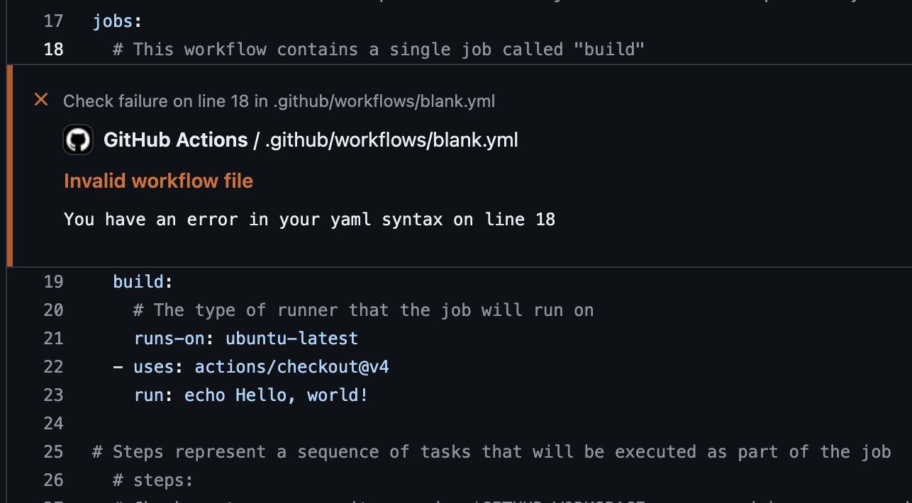
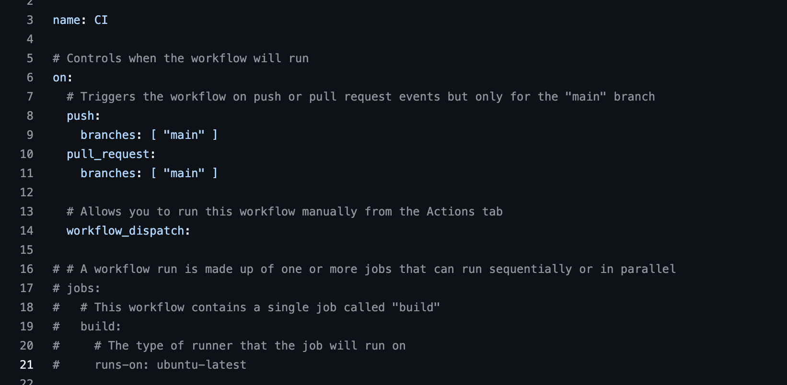
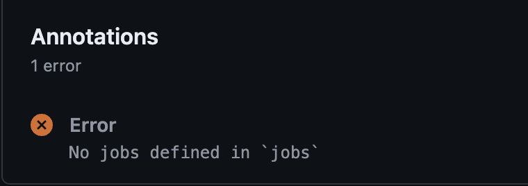

# Basics of a GitHub Actions Workflow

CICD is essentially an assembly line for your projects, which Github Actions plays a critical role in.  It automates the repetitive tasks of building, testing, and deploying your code, ensuring everything runs smoothly and consistently. Just set up the steps, and it keeps things moving efficiently without constant oversight.

GitHub Actions is Github's own automation tool, helping you build, test, and deploy code directly from your GH repository UI.

Using YAML config syntax, it allows you to write customized workflows triggered by specific events in your repository, such as pushes, pull requests, or schedule-based cron jobs.

## Workflows

Workflows are to Github what production flowcharts are to an assembly line.

These are the instructions you define a sequence of steps to execute the actions you need in a linear order.

Workflows are created directly inside your repository as YAML files located in the `.github/workflows/` directory. You can set as many workflows as you need, with each being **triggered** by different **events** such as code push, pull requests, or manually via GitHub UI.

### Basic Workflow Syntax

```YAML
name: Echo Workflow
on:
  push:
    branches:
      - main

jobs:
  echo-job:
    runs-on: ubuntu-latest
    steps:
      - name: Echo Message
        run: echo "Hello, DevOps!"
```

Workflows essentially consist of two halves.  One half configures *aspects of the workflow itself*, like its `name`, and the conditions in which it fires.  This is done by specifying under an `on` field an `event trigger`, along with parameters relevant to this trigger.

The other half configures what the workflow *does*.  We name the job, what evironment the job will run in, and what actions or tasks to execute at each step of the job.

Simple enough, right?  Now that you're familiar with the basic format of a workflow, let's dive deeper into each aspect of the workflow.

### Top-Level Configurations

Before writing out what your workflow *does* (job-level configurations), you must first define what your workflow *is* (top-level configurations).

#### Standard Configurations

**Event triggers** are among the very first configurations defined in a workflow, along with the `name` of the workflow, `defaults` (default values) and `env` (environment variables).  The syntax for these triggers uses the keyword `on` keyword.

We'll cover default and environment variables in the next lesson; just know for now that by defining them in the **top-level configuration** section of your workflow, they become accessible to everything at the **job-level configurations** of your workflow.

The `name` and `on` fields should be included in every workflow.  Including `name` isn't absolutely critical, as Github will use the filename if this field is empty, but it's good practice to include and takes minimal effort.  Including `on` technically isn't absolutely required either, but you can't automate the flow without it.  You'll still be able to manually trigger the flow through the Github UI, but that's not exactly scalable or practical in a real world production environment.

Here's an example of these two fields in a workflow:

```YAML
---
name: Echo Workflow

on:
  push:
    branches:
      - main
  pull_request:
    branches:
      - main

```

Within the `on` block, we are specifying two event triggers.  Triggers are independent of one another.  That means the workflow will fire if **either** of these are satisfied, not necessarily both.

> There is no native way to require that two or more asynchronous events fire in order to trigger a workflow, such additional complexity isn't worth the effort of implementing given how niche uses cases for this may be.

#### Advanced Configurations

There are other top-level configurations that you can set such as *run-name*, which allows you to set dynamic names for each workflow run, and *concurrency*, which controls how concurrent runs are managed.

We're not going to worry about these for now, as they won't become useful until your workflow develops considerable complexity.  We'll touch upon them again briefly in the next lesson when we cover `contexts`.

### Job Level Configurations

#### Hierarchy

Once you've defined top-level configurations that more or less configure the workflow itself, you can begin writing out what the workflow will actually do.

>
> **Workflow Hierarchy**
>
> - `Workflow` > `Jobs` > `Steps` > `Actions`
>

This part of the workflow is broken down into `jobs`, which are collections of `steps`, which are where `actions` are executed.  

This hierarchy flows from jobs to steps, then to actions.  Disrespecting this hierarchy will result in errors and a failed run.


<!-- - Jobs define the environment and sequence and can have the following configurations:
  - Environment variables
  - Dependencies
  - Timeouts
  - Conditions
  - Outputs
  - Containers
  - Services
- Steps define individual tasks
  - sdgsdgs
  - 
- Actions define reusable tasks -->



> Actions can not be run outside of a `step` block




> Steps will not be recognized without being nested into a `jobs` block

Several configurations can be set at each layer of this flow.  Let's take a look at some simple ones.

```YAML
---
name: Echo Workflow

jobs:
  echo-job:
    runs-on: ubuntu-latest
    steps:
      - name: Echo Message
        run: echo "Hello, DevOps!"
      - name: Checkout code
        uses: actions/checkout@v2
```

#### Jobs & Runners

Here, we have a job named "echo-job", and we specify the environment `runner` with the runs-on command. This same runner is used to execute every step in this job.

Since each job runs in its own virtual environment, either in parallel or sequentially (depending on your configuration), different environment runners can be set for each job.  

> Runners are necessary for jobs to run.  Forgetting this will result in an error and failed run.

 
#### Steps & Actions

The way jobs run a sequence of steps, steps run a sequence of actions.

In the same example from above, our echo-job runs a two-step sequence.

The first step `run` runs the familiar environment command `echo`, which outputs a message to the console logs.

The second step `use` calls the `checkout` **Action**, which is perhaps the most common and widely used **Action** you'll come across.

***What's so special about the Checkout Action?***

The `checkout` action checks-out your repository under your Github workspace, making it accessible to the rest of your workflow.

This means if you're writing a workflow to deploy a Python Flask application, your workflow won't be able to run the `requirements.txt` file in your project until you've used the `checkout` action.

***What about the `actions/` at the start of checkout and `@v2` at the end?***

The first part of this value references the source of the action.  In this case, checkout being an official Github provided action, comes from its own [actions orgnization collection of repositories](https://github.com/actions).

The second part references the version you wish to use.  Being executable code that can evolve and change over time, **Actions** can over time build up a release history.  This means that you'll need to be mindful about version compatibility when using **Actions**, just as you would when choosing packages, frameworks and modules as you build out your app.

##### Actions vs. Tasks

Up until now, we've been using the word *actions* to reference what occurs when a step is executed.

Technically, **Actions** are reusable pre-built components that need to be called in order to execute, which makes them different from tasks that run commands native to the running environment.

Also technically however, a task running a command is itself an action.  Like task commands Actions are actions, though actions are not restricted to **Actions**.

This essentially boils down to semantics, so how you utilize this terminology from here on out is entirely on you.  We'll use **Actions** with a capital A when referring specifically to reusable components, and actions with a lowercase a when speaking generally about what a step can do.

##### Additional Actions

While official Github **Actions** can be found publically in a [repository org hosted by Github](https://github.com/actions) itself, **Actions** can also be found in other repositories and elsewhere on the web.  You can even write and share your own!

Given the nature of **Actions**, be mindful of how reputable the source of an **Action** you find may be.  As with anything else on Github, pay attention to the number of contributers, users, comments, engagement, etc., to help gauge the credibility of any unofficial **Action** you find.

### Multi-Job Workflows

Let's take a look at one more workflow example before recapping and writing our own from scratch.  

```YAML
---
name: Multi Workflow

jobs:
  job1:
    runs-on: ubuntu-latest
    steps:
      - name: Make directory
        run: echo "Making a new directory!"
      - name: Multi line step
        run: mkdir some-subdirectory
  job2:
    runs-on: ubuntu-latest
    strategy:
      matrix:
        node-version: [14, 16, 18]
    needs: job1
    steps:
      - name: Change directory
        run: echo "Changing directory!"
      - name: Multi line step
        run: |
          cd ./some-subdirectory
          pwd
          echo "We are now in the new directory!"
      - name: Set up Node.js
        uses: actions/setup-node@v2
        with:
          node-version: ${{ matrix.node-version }}
```

Here, we're defining multiple jobs.  Things to note:

- Every job needs a runner

Each job must specify its own runner using runs-on, even if they are the same.  

We mentioned `defaults` earlier, which we'll cover in the next lesson. For context, `defaults` allow you to specify configurations to be applied to all jobs (until implicitly overwritten).  By design however, runners can't be specified in the `defaults` block of the top-level configuration.

- Jobs run in parallel unless dependencies are specified

By default, jobs will run in parallel by default, even within the same workflow.

This is where dependencies can come in handy.  By providing a `needs` value in *job2*,  we can ensure that these jobs do not run concurrently.  Instead, *job2* will run only if *job1* succeeds.

- Multi-line commands are valid

When running commands, we can pass in a pipe character to allow for multi-line commands.

- Actions can be used to install additional dependencies within an environment

Runners only allow you to specify the operating system in which your environment runs.  As you may already know, not all systems are equal.  Different OS's and distributions come in a variety of preset configurations and will have different combinations of dependencies installed.

**Actions** can be used to set up dependencies like **Node** or **Python**, giving you access to commands like `npm install` or `pip`.

- Strategies can add complexity & flexibility to a flow

In the above example, we specify a matrix under `strategy` at the job level in *job2*.  This essentially allows us to create an array of values that we can later pass on to the `with` field at the **Action** `actions/setup-node@v2` level in the "Set up Node.js" step, allowing the action to install three different Node versions within the same workspace.
  
### Workflow Recap

- You can think of Workflows as consisting of two halves:
  - Top-level configurations allow you to configure the workflow itself
  - Job-level configurations allow you to configure what the workflow does
- Workflows follow a `Job` > `Step` > `Actions` hierarchy
- Actions are reusable units of code used in workflows
- GitHub provides a marketplace with pre-built actions, or you can create custom ones
