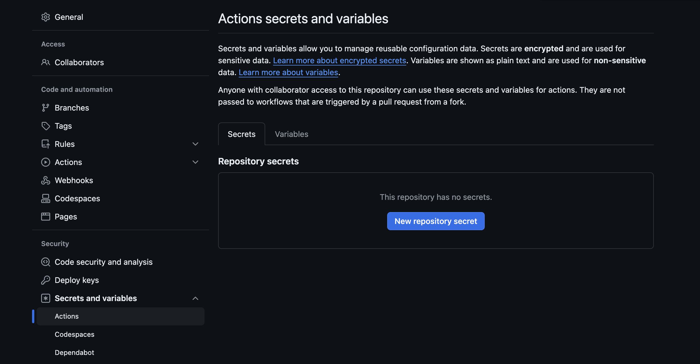

# Contexts, Secrets & Conditionals

Contexts allow for the passage of information in a workspace.  This makes critical data such as environment variables, secrets and workflow metadata to be accessible throughout a workflow run.

As structured data, contexts can be used and reused, in simple references and in more complex expressions.  The complexity that can be produced through expressions include the usage of conditional logic, allowing for more dynamic workflow behavior.

Contexts give access to a range of information, with over a dozen contexts specified in the [official Github docs on context](https://docs.github.com/en/actions/writing-workflows/choosing-what-your-workflow-does/accessing-contextual-information-about-workflow-runs#github-context).

Contexts utilize expression syntax: `${{ <context> }}`.

## Context Types

In the previous section, we mentioned *run-name* and *concurrency* when describing advanced top-level workflow configurations.  In the example we provided, you were introduced to this syntax:

```YAML

run-name: Deploy to ${{ inputs.deploy_target }} by @${{ github.actor }}

concurrency:
  group: ${{ github.workflow }}-${{ github.ref }}
  cancel-in-progress: true
```

In the above example, `inputs.deploy_target` and `github.actor` are examples of `contexts`.  You may not come across inputs too often, atleast not while you're new to writing workflows.  Inputs are only available in workflows that are reusable or triggered by the `workflow_dispatch` event (manual triggering).

You'll likely interact with the `github` context more frequently, as this context references repository metadata.  This includes a information such as the name of a workflow, a workspace's working directory, a workflow's run number or run ID, the repository's URL, etc.  The above examples represent the user who triggered the workflow (`github.actor`), the name of the workflow (`github.workflow`), and the fully formed ref of the triggering branch (`github.ref`).

### Variable Contexts

We saw in the previous lesson that environment variables could be set in the top-level configuration of a workflow.  

Environment variables are key-value pairs that can be used to dynamically set and share configuration and data in your GitHub Actions workflows.

You may already be familiar with environment variables, and the practice of storing them in hidden `.env` files at the root of your project directory.  This allows your application access to these variables from any part of the app.

As the name suggests, these variables can be thought of as being globally accessible within an environment.  While that ensures your app will have access in one environment, it does not ensure your application will have access in another.

What other important aspect of .env files pertains to this?

Standard practice is that .env files are referenced within the .gitignore file, ensuring the variables in this file do not transfer over to a repository, which would expose them publically rendering the practice moot.

This means that environment variables will have to be set for each individual environment your application will exist in.  And that includes the Github Actions Workflow environment.

#### Env

The `env` context contains environment variables that have been set at a workflow level.  This includes variables defined in the top-level configuration, as well as the job and step configuration levels.

Because environment variables are passed downstream, they can be overwritten as needed.

```YAML
name: Variables Example
on: push
env:
  key1: Value_A # We can set variables at the top level to be passed downstream
  key2: Value_B

jobs:
  example_job:
    runs-on: windows-latest
    steps:
      - run: echo 'Value = ${{ env.key1 }}' # Value = Value_A
      - run: echo 'Value = ${{ env.key1 }}' # Value = Value_C
        env:
          key1:  Value_C # We overwrite the value of key1 for this particular command
  another_example_job:
    runs-on: ubuntu-latest
    env:
      key1: Value_D # We can also overwrite at the job level
    steps:
      - run: echo 'Value = ${{ env.key1 }}' # Value = Value_D
```

In the above example, *key1* outputs 'Value_A' at the first command of the first step of the first job.  For this step's second command, we overwrite *key1* to output 'Value_C'.

In the second job, we overwrite the value *key1* again to output 'Value_D'.

#### Vars

The `vars` context is nearly identical to the `env` context, referring to variables, but specifically those set at the repository, environment or organizational level.  These variables are set through the settings tab of a repository or Github org.

The environment can be found in a repo's settings as well, but may not appear until an environment has been defined in a workflow like so:

```yml
jobs:
  deploy:
    runs-on: ubuntu-latest
    environment: production
    steps:
      - name: Deploy
        run: echo "Deploying to production"
```

### Job, Jobs, Runner & Steps Contexts

Several contexts can be used at the job level of the configuration to reference information. 

The `job` context contains information about the currently running job, such as the job's container and the container's id or network (ex: `job.container.network`).

The `jobs` context is available specifically in reusable workflows, where multiple job_ids for the same job can be generated.  (ex: `jobs.<job_id>.result`).

The `runner` context contains information about the runner of the current job, providing access to details such as `runner.name`, `runner.os` (ex: Linux, macOS), and `runner.arch` (ex: X86, ARM)

The `steps` context contains information about steps in the current job that have completed and an `id` specified.  For example, `steps.<step_id>.outcome` will return the results of a completed step.

### Best Practices

As objects that contain properties, which can include not only strings but other objects as well, you should always consider whether or not you can trust the contents of workflows and actions you come across online.  There is always the potential for attackers to hide malicious content inside code.

You should be just as mindful of strong security practices as well when writing your own workflows and actions.  Even sensitive information such as tokens can be read through the `github` context, so you'll want to be cautious and intentional of how you use it.

Speaking of sensitive information...

## Secrets

### Managing Sensitive Data with GA secrets

GitHub Actions provides a secure way to store and use sensitive information (like passwords, SSH keys, and API tokens) using **secrets**.

This is done by going into your repository settings and creating secrets under `Secrets` from the sidebar.



From here, you can set as many secrets as you'd like.

### Setting Multiple Secrets

While setting secrets using the Github UI is relatively painless, it can be slow.  You have to load up a browser, wait for page responses, and click through a number of menu options only to end up creating secrets one a time.

With the GH CLI, you can create secrets like a champ straight from your local machine terminal using the [`gh secret set` command](https://cli.github.com/manual/gh_secret_set).

```bash

## Set repository secrets from Environment Variables file to set multiple secrets with a single command
gh secret set -f .env

## Set individual repository secrets from other types of files
gh secret set SSH_PRIVATE_KEY < ~/.ssh/id_rsa.pem
```

The first example is pretty self explanatory.  We use the `-f` argument to reference an environment file containing multiple key/value pairs, allowing us to set many secrets with just one command.

We can also read values from other types of files that don't necessarily contain key/value pairs.  In this example, we pass in the key we want to store the secret as, and we use the `<` character to [*redirect*](https://www.gnu.org/software/bash/manual/html_node/Redirections.html) the contents of our SSH key into that variable.

### Reading Secrets

With your secrets safely stored in your Github repository, they'll be available for use in your workflows.

```yaml
name: Example Workflow
on: push
jobs:
  build:
    runs-on: ubuntu-latest
    steps:
    - name: Use secret as environment variable
      run: echo "Secret is ${{ secrets.DATABASE_PASSWORD }}"
```

Just like any other context, secrets are read using expression syntax.

## Conditionals


In GitHub Actions, you can control whether jobs or steps run based on specific conditions. These conditions are written using expressions, making your workflows more flexible.

Just like contexts, conditions in GitHub Actions are written as expressions using `${{ }}`.  The `if` can be used to apply conditions to jobs or steps.

## Conditional Configurations at the Job Level

You can conditionally run an entire job based on a specific condition:

```yaml
jobs:
  deploy:
    runs-on: ubuntu-latest
    if: github.ref == 'refs/heads/main'
    steps:
      - run: echo "Deploying to production"

```

You can also apply conditions to individual steps within a job:

```yaml
jobs:
  build:
    runs-on: ubuntu-latest
    steps:
      - run: echo "Running tests"
      - run: echo "Running build step"
        if: ${{ success() }}
```

The the test step runs unconditionally whereas the build step only runs if the tests step succeeds.

You can even combine conditions using logical operators like `&&` (and), `||` (or), and `!` (not):

```yaml
if: ${{ github.event_name == 'pull_request' && success() }} # Runs only if both conditions are met
```

## Scheduled & Event Triggered Workflows

Open up your terminal and code editor of choice.  The following exercise will step you through setting up:

- Various methods of setting environment variables 
- Set up scheduled triggers and how to automatically deploy a static website to an Amazon S3 bucket following an event using GitHub Actions workflows.
- Setting conditionals

Scheduled triggers allow you to run workflows at specific times, which is useful for tasks like nightly builds, regular dependency updates, sftp file downloads or routine checks.

Other times, you'll want a workflow to trigger after a specific event or action, such as spinning up a test, build and deploy pipeline after each new version release.

### Step 1: Create a New Repository

1. Create a new repository, either locally using `gh repo create`, or through the Github UI.
2. Initialize the repository with a README.

### Step 2: Manually Set Up a Workflow File

You've seen by now how easy it is to create a workflow file through the Actions tab.  While this is a convenient way to create a file, it is not the only way.

Working from your terminal, you can create one like so:

1. In your repository, create a new directory: `.github/workflows`.
2. Inside this directory, create a file named `schedule.yml`.

### Step 4: Defining a Scheduled Workflow

Add the following content to `schedule.yml`:

```yaml
name: Scheduled Workflow

on:
  schedule:
    - cron: '0 0 * * *' # Runs at midnight every day

jobs:
  build:
    runs-on: ubuntu-latest

    steps:
    - name: Checkout Repository
      uses: actions/checkout@v2

    - name: Run a Script
      run: echo "Performing $environment task at $(date)."

```

This will trigger this particular workflow to kick off at midnight every day.  Since class ends before then, let's set it to something more practical, like whatever time it is 10 minutes from now every day.

Cron syntax has five fields separated by a space, and each field represents a unit of time.

```md
┌───────────── minute (0 - 59)
│ ┌───────────── hour (0 - 23)
│ │ ┌───────────── day of the month (1 - 31)
│ │ │ ┌───────────── month (1 - 12 or JAN-DEC)
│ │ │ │ ┌───────────── day of the week (0 - 6 or SUN-SAT)
│ │ │ │ │
│ │ │ │ │
│ │ │ │ │
* * * * *
```

You can also use tools such as [Crontab Guru](https://crontab.guru/) to quickly generate this new cron expression. and update your workflow.

<!-- Next, let's set up a separate workflow for event based triggers.

### Step 5: Configuring GitHub Repository Secrets

The goal is to deploy a static website to an amazon S3 bucket, so we'll need to set some secrets.  Either set these using the Github CLI or go over to your UI and set these secrets.

- `AWS_ACCESS_KEY_ID`: Your AWS access key.
- `AWS_SECRET_ACCESS_KEY`: Your AWS secret access key.
- `AWS_S3_BUCKET`: The name of your S3 bucket.

### Step 6: Create a second GitHub Actions Workflow

1. Add a new workflow `update.yml` to your workflow directory for pushing changes to S3 bucket.
2. Name it "Deploy to AWS S3"
3. Set it to trigger on pushes made to the `main` branch.
4. Run it on the latest ubuntu version and set the first step to "Checkout Repository" using `actions/checkout@v4`.
5. Create anther step called "Configure AWS Credentials" using `aws-actions/configure-aws-credentials@v4` to set an `aws-access-key-id`, `aws-secret-access-key` and `aws-region`.
6. Finally, create a step called `Deploy to S3` running the following:

```yml
  run: |
  aws s3 sync . s3://${{ secrets.AWS_S3_BUCKET }}
```

7. Save your workflow and push your changes.

### Step 7: Review -->

Has your workflow kicked off?  Use the actions tab to confirm.

## Key Takeaways & Recap

- Contexts can refer to metadata (ex: names, refs) and environment variables (key-value data pairs)
- Github Secrets are contexts that allow you to abstract away sensitive data
- GH secrets can be managed through both the Github UI and the Github CLI
- Conditional expressions like `if` can reference contexts to evaluate conditions

### Resources

[Full List of Contexts](https://docs.github.com/en/actions/writing-workflows/choosing-what-your-workflow-does/accessing-contextual-information-about-workflow-runs#context-availability)

