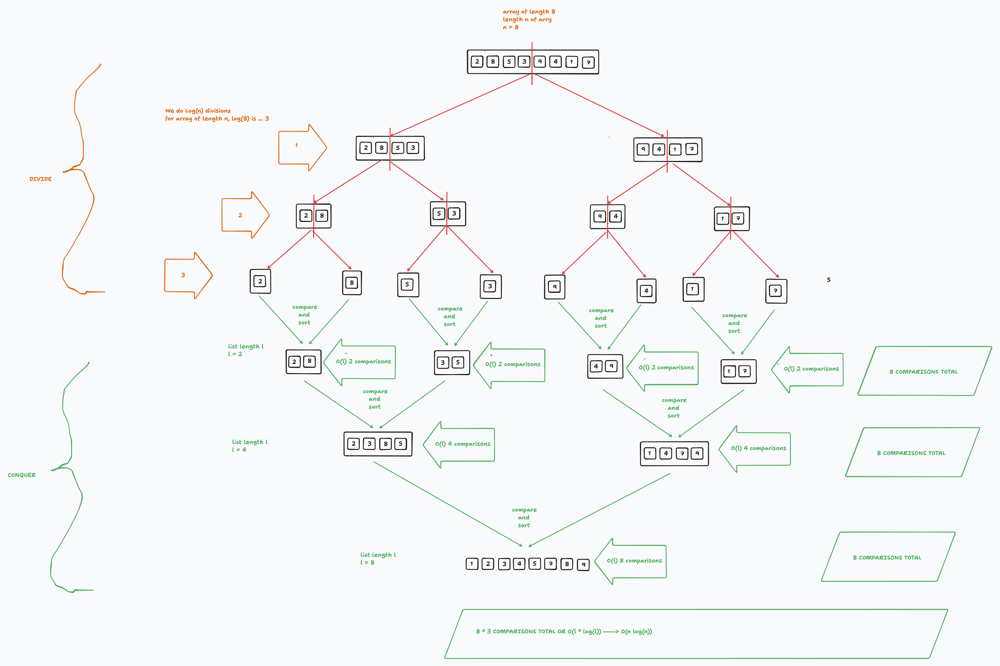

# Merge Sort and Complexity Analysis

## Warmup & Review: Merge Sort is a Divide and Conquer Algorithm

### Divide and Conquer Algorithms

Merge sort is a "divide and conquer" sorting algorithms. Divide and Conquer Algorithms:

1. **Divide** a problem down into subproblems that are instances of the same problem.
2. **Conquer** the subproblems by solving them individually.
3. **Combine** the subproblem solutions to get the solution for the original problem.

A *search* algorithm we encountered, Binary Search, is another Divide and Conquer algorithm.

Later when we do a deep dive into *recursion* we will see how most Divide and Conquer Algorithms are best implemented recursively. Today we will write Merge Sort imperatively for learning purposes. The algorithm itself is the same - there are just two different ways of implementing it. 

**Divide and Conquer Algorithms are often O(log(n))**

Because we recursively keep dividing our 'search space' or 'sort space' in half, divide and conquer algorithms often have logarithmic worst-case runtimes.

### Mergesort is O(n log(n))

Mergesort is not quite O(log(n)) - it is O(n log(n)). Why is this? Let's analyze the *algorithm*, and then look at it's implementation.

Note that the specific order these steps happen in can depend on how we implement the algorithm, but this is a good overview.

Mergesort is:

1. Divide the array in half, into two sub-arrays. 
    - Repeat this process, dividing each sub-array in half until we have broken down the array into individual items.
    - When we visualize this it will form a tree.
2. Compare two individual items (the "leaves" at the bottom of the tree), and sort them into a temporary array.
    - Do this for all the "leaves" of our tree - all the individual items.
3. Combine each sorted subarray
    - **Compare** each item in each sub array, and sort them as we combine them (repeat Step 2)
4. Success!


We will discuss the implementation code in a bit, let's "walk through" the algorithm and discuss how the algorithm works and it's runtime complexity first using this visualization.



## How does it work?

For now our implementation is *iterative*, later we will learn how to implement this algorithm *recursively*:


```python
def merge_sort_iterative(items):
    """Merge sort function implemented iteratively. Takes a 
    list of integers, returns them sorted in increasing order."""
    
    items_len = len(items)
    
    # The 'base case' - no need to sort.
    if items_len <= 1:
        return items
    
    # We are going to build our sub-lists 'bottom up' - breaking each item in the list into its own sublist of length 1,
    # then combine them into sublists of length 2 (and sort them), combine those into sublists of length 4, and so on.
    sublist_len = 1

    while sublist_len < items_len:
        # This is the key:
        #  range(start, stop, step) does ..
        # range(0, 10, 2) is [0, 2, 4, 6, 8]
        # This for loop chunks the entire list into sublists of length 2, 4, 8, and so on 
        # https://cs.stanford.edu/people/nick/py/python-range.html
        for i in range(0, items_len, 2 * sublist_len):

            # left sublist of desired size
            left_sublist = items[i:i + sublist_len]

            # right sublist of desired size
            right_sublist = items[i + sublist_len:i + 2 * sublist_len]

            # compare, sort, and merge the two sublists
            merged_sublists = merge(left_sublist, right_sublist)

            # Copy the merged sublist back into the original list at the correct spot.
            items[i:i + len(merged_sublists)] = merged_sublists
        
        # Once all the smaller sublists of size sublist_len are sorted,
        # double sublist_len so we compare and sort the sublists of the next size up, so to speak.
        sublist_len *= 2
    
    return items

def merge(left, right):
    """Assumes left and right are sorted lists. Look at the first element 
    of each list, and moves the smaller of the two to the end of the result list. 
    When one of the lists is empty, all that remains is 
    to copy the remaining items from the other list."""

    result = []
    i, j = 0, 0

    while i < len(left) and j < len(right):
        if left[i] < right[j]:
            result.append(left[i])
            i += 1
        else:
            result.append(right[j])
            j += 1

    while i < len(left):
        result.append(left[i])
        i += 1
    while j < len(right):
        result.append(right[j])
        j += 1

    return result

# Example execution of our algorithm
data = [2, 8, 5, 3, 9, 4, 1, 7]
sorted = merge_sort_iterative(data)
print(sorted)
```
 
 Let's also put our merge sort implementation into this [PyAlgoViz Interactive Visualizer](https://pyalgoviz.appspot.com/show?name=Sorting%20-%20MergeSort) and watch it run, and run it step-by-step.

### Implementation Breakdown

1. Initial Check and Base Case:
    - If the list has 1 or 0 elements, it is already sorted and is returned as is.

2. Sublist Creation and Merging:
    - The outer while loop handles the merging process in increasing sublist lengths, starting from 1 and doubling each time.
    - The inner for loop splits the list into sublists of the current length (sublist_len), merges them using the merge function, and updates the original list with the merged results.

3. Merge Function:
    - Merges two sorted sublists by comparing elements one by one and appending the smaller element to the result list.
    - After one of the sublists is exhausted, the remaining elements of the other sublist are appended to the result.

## Resources

[Video - Merge Sort in 5 Minutes](https://www.youtube.com/watch?v=4VqmGXwpLqc)
