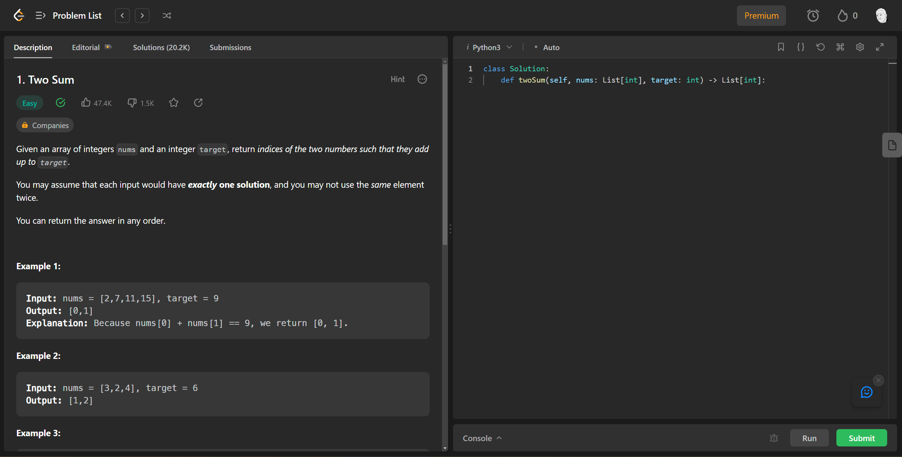
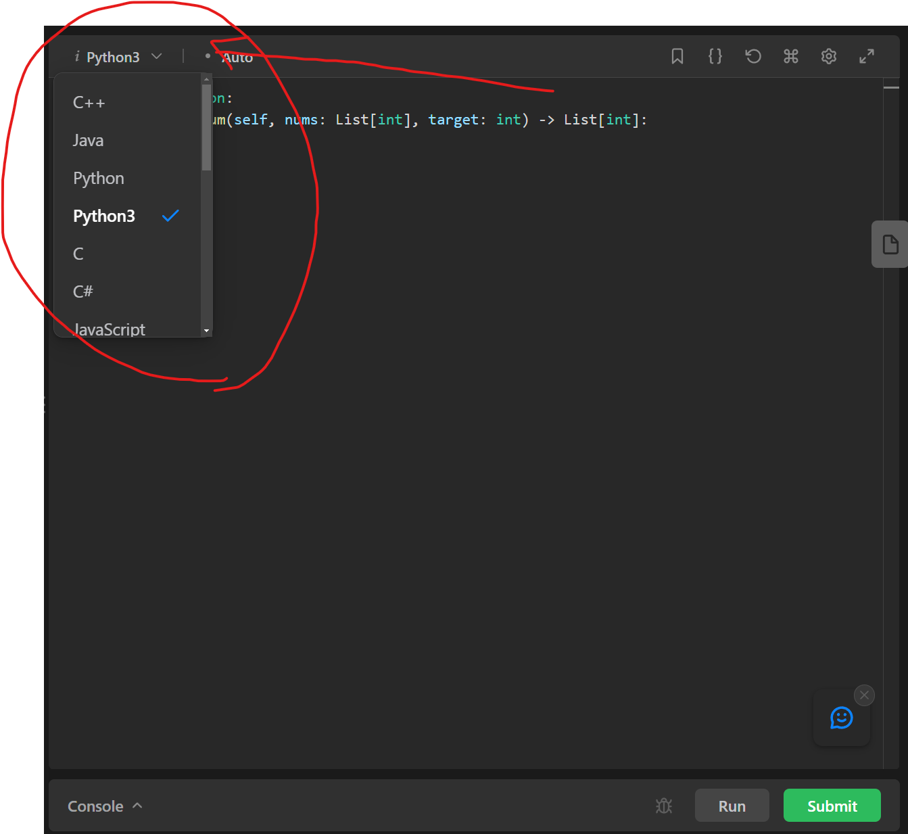
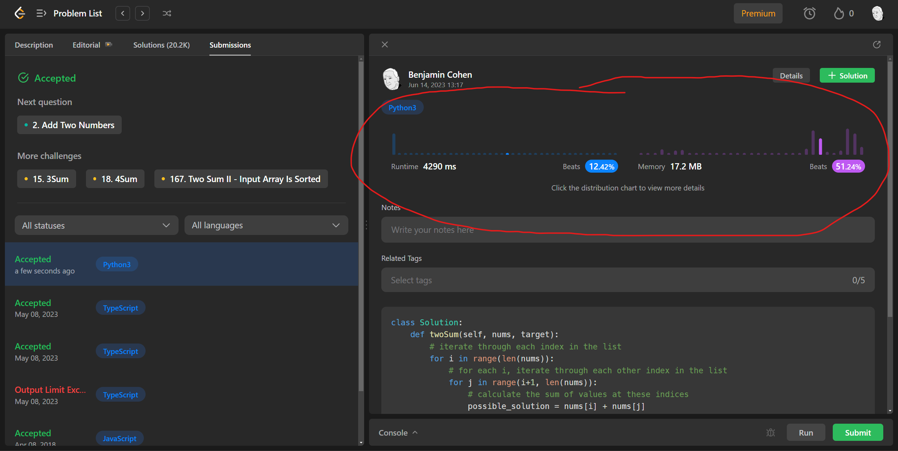
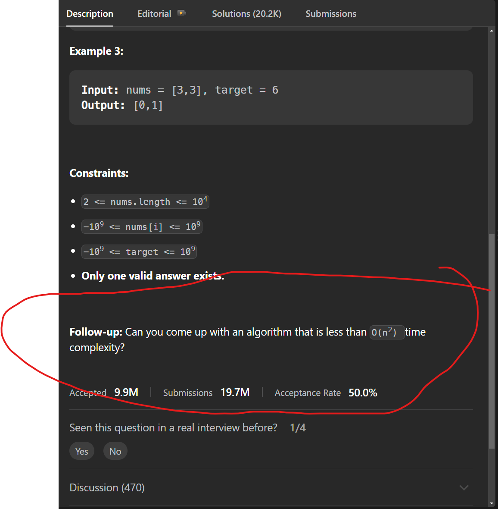

# Leetcode: How to use it & why

## Introduction

[LeetCode](https://leetcode.com) is one of the most popular platforms for the kinds of programming problems you'll encounter in technical interviews. It is also one of th most popular tools to use to practice for technical interviews. Familiarity with it is important both for your own interview prep and for when you encounter it or similar tools in the interview process, whether as a coding challenge early in the application process or during a technical interview.

## Lecture

Let's look at a classic example of an 'easy' level problem on LeetCode just to get a sense of what it looks like - [Two Sum](https://leetcode.com/problems/two-sum/).

Let's break down this page. On the left you'll see a description of the problem, including input => output examples.

On the right you will see a code editor. Notice in the to left of this section you can select the language of your choice:

You will generally be allowed to choose the language you feel most comfortable with, unless explicitly specified otherwise.

From here you can write a solution and test it along the way with the 'Run' button, which will run your solution against some sample cases, including ones you write yourself if desired. Logging to the console will also be output here:

When you feel good about the solution you can hit 'Submit'. This will run your solution against way more test cases, which you cannot see, but it will account for any edge case basically.

If you pass all the test cases you will see a screen like this. Noticed the highlighted section - I am being measured against other passing submissions in terms of both runtime and memory usage. This is an example of the 'analysis' section that comes at the end of a succesful solution - you will be asked to analyze the efficiency of your solution and if you might be able to optimize it. Now let's close this solution panel and go back to the 'Description' tab on the left part of the screen. Scroll down to the 'Follow Up' section:

Note the follow-up question about the Big-O of your solution. It is common in technical interviews to discuss the runtime complexity of your code and if it is possible to come up with a more efficient solution or not.

## Conclusion

Leetcode is an important preparation tool and platform to be familiar with in order to successfully prepare for and succeed at technical interviews.