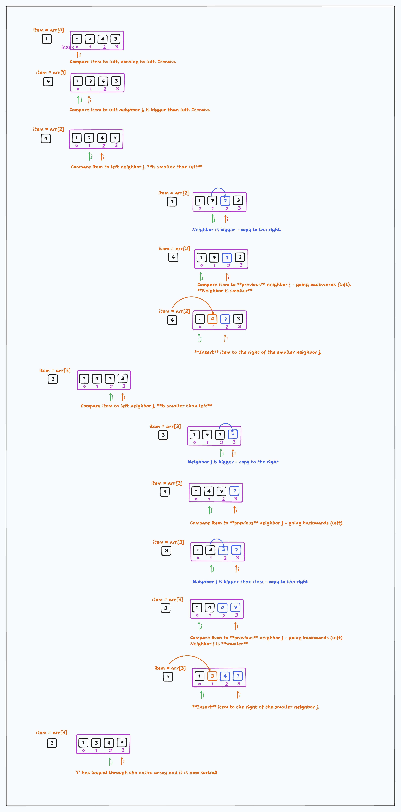

# Bubble Sort and Insertion Sort

You will learn:

- Analysis of Bubble Sort and how to improve it's best-case performance
- The Insertion Sort Algorithm and it's runtime performance / Big-O
  - How Insertion Sort performs better for the special case of an 'almost sorted' or k-sorted array.
- How to do a basic Algorithm Analysis:
  - How to explain and describe an algorithm at a high level - without writing code for the implementation
  - Best-case, average-case, worst-case runtime
  - How to come up with simple sample input that produces the best case, average case, or worst case scenarios respectively.

> *Review Question:* What is Big-O, and why do we care about it?

## Bubble Sort: Warmup & Algorithm Analysis 

Let's begin up by looking at the humble Bubble Sort, which We looked at in our [previous lesson on Big-O](https://github.com/Code-Platoon-Curriculum/curriculum/blob/ds_module_fridays/11-DS-Algorithms/2-big-o/2-determining-big-o.md#4-on---quadratic-time). Let's use it as a review and warmup before learning and analzying some new sorting algorithms. Answer the following:

Here is the implementation of Bubble Sort from before:

```python
# O(n²) - Quadratic Time
def bubble_sort(arr):
    n = len(arr)
    for i in range(n):
        for j in range(0, n - i - 1):
            if arr[j] > arr[j + 1]:
                arr[j], arr[j + 1] = arr[j + 1], arr[j]
```

### Review Questions: Bubble Sort Algorithm

Let's refresh ourselves about the *algorithm* and discuss it:

#### In plain english, describe how Bubble Sort works

- Start at the beginning, and compare each item to it's neighbor to the right.
- If the neighbor is bigger, swap their positions.
- Go through the whole list doing this, and, repeat the whole process from beginning to end until all items are in order.

[Here is an interactive visualization of Bubble Sort in action with python code!](https://pyalgoviz.appspot.com/show?edit=False&name=Sorting%20-%20BubbleSort)

#### What is the Big-O of Bubble Sort? What data produces it's worst-case runtime?

> Let's create some simple example data to visualize it.

```python
data = [4, 3, 2, 1]
```

### What data produces Bubble Sort's best-case runtime?

If the list is already sorted, our algorithm doesn't have any work to do! A sorted list produces Bubble Sort's best-case runtime complexity.

```python
data = [1, 2, 3, 4]
```

#### Reality check - does our implementation perform well for the best-case scenario?

If we look at our current implementation of Bubble Sort, it actually does *a lot of extra work* for our best-case data! It still loops through the list n^2 times even though the list is already sorted! Our implementation *doesn't know the list is already sorted*.

#### How can Bubble Sort Tell Once It's Done?

Bubble Sort can tell once it's done - that the list is already sorted - if it loops through the list once **without performing any swaps**. Let's add a boolean variable `swapped` to our implementation to keep track of this:


```python
# O(n²) - Quadratic Time
def bubble_sort(arr):
    n = len(arr)
    for i in range(n):
        swapped = False
        for j in range(0, n - i - 1):
            if arr[j] > arr[j + 1]:
                arr[j], arr[j + 1] = arr[j + 1], arr[j]
                swapped = True
        if not swapped:
            break
```

What is the best-case runtime performance of this improved version of Bubble Sort?

It is **O(n)**

In the best case, with a sorted list, our algorithm now only needs to iterate through the list once, will determine the list is sorted, and then stop.

### What data produces Bubble Sort's average-case runtime?

The best way to come up with data for an average case runtime is often to use random data. Let's make our input list a bit bigger and use:

```python
[3,1,4,7,5,8,6,2]
```

If we visualize and run our improved Bubble Sort with this data, it's runtime may not always be exactly n^2 but it is often close, and as n gets very big, n^2 is still close to the average case runtime.

### Bubble Sort - Summary

Bubble Sort is O(n^2)

We've learned that we can make an improvement to Bubble Sort that improves its best-case performance, and to a degree, it's average-case performance, but has zero impact on it's worst-case performance.

- Best Case: O(n) - when the array is already sorted.
- Average Case: O(n^2) - for a randomly ordered array.
- Worst Case: O(n^2) - when the array is sorted in reverse order.

## Insertion Sort

### What is it?

Insertion sort takes an array *n*, and loops through the array left-to-right. It takes each item, compares it with it's neighbor to the left, and if the neighbor is smaller, swaps them. **It then keeps comparing and swapping to the left**, shifting the item left until it finds it sorted position. To reiterate:

Insertion sort, like Bubble Sort, uses **two nested loops** to sort an array left-to-right. Like Bubble sort, Insertion Sort compares an item to it's neighbor to the left, and if the left item is bigger than the right one, swaps them. *Unlike* Bubble Sort, Insertion sort will **keep comparing and swapping that same item** until it finds the correct sorted position for it in the array.

> Knowing that Insertion Sort uses two nested loops, what would you guess it's Big-O is?

### How does it work?

Insertion sort "bubbles backward" - when it finds an item out-of-order, it keeps going left, **and shifting bigger items forward**, until it finds the right spot in the array for the item and **Inserts** it there.

1. Loop through the array left-to-right.
2. Examine each item and compare it to it's left neighbor. If the neighbor's bigger, *shift the neighbor right*, and keep comparing backwards
3. Once a smaller leftmost neighbor is found, *insert* the item at the correct position in the array.

We will see that Insertion Sort forms a *partially sorted* array as it goes.

Here is an implementation of Insertion Sort:

```python
def insertion_sort(arr):
    for i in range(1, len(arr)):
        item = arr[i]

        # Compare item to left neighbor arr[j]. if arr[j] is bigger, shift j right.
        # Decrement j and keep comparing item to arr[j] and shifting until arr[j] is smaller than item.
        j = i-1
        while j >= 0 and item < arr[j] :
                arr[j + 1] = arr[j]
                j -= 1

        # item is bigger than arr[j] - insert item to the left of j.
        # Everything in the list up to index j+1 is now guaranteed to be sorted.
        arr[j + 1] = item

    return arr


# run our algorithm
arr = [1, 4, 7, 3]
insertion_sort(arr)
for i in range(len(arr)):
    print ("% d" % arr[i])
```

Let's visually work through it, and then do a complexity analysis of the algorithm.  Notice how Insertion sort builds up a *partially sorted* array as it goes.



> Recommended: Also look at the Insertion Sort animated video and interactive visualization at the bottom of this doc under 'Resources'

### Complexity analysis

#### Worst-case performance

Not surprisingly, **Insertion Sort is O(n^2)** - like Bubble Sort it's worst-case performance is quadratic. As we've seen, data in the opposite desired order - greatest to least, if we want to sort least-to-greatest, will produce Insertion Sort's worst-case runtime.

#### Best-case performance

We can intuit that a sorted array will produce best-case runtime for Insertion sort. Consider:

```python
arr = [1, 2, 3, 4]
insertion_sort(arr)
```

- For the first element (index 0) no comparison is needed.
- For the second element (index 1) one comparison is made.
- For the third element (index 2) one comparison is made, and so on for all the other elements in the array.

Thus the total number of comparisons in the best case is  *n - 1* which is *O(n)

#### Average-case performance

A randomly ordered array produces average-case performance. Insertion Sort is still O(n^2) for the average case, we still see worst-case n^2 performance about half the time, so as input size n gets very large we only care about n^2 which increases the most. Thus O(n^2).

### Insertion Sort Performs well for "almost-sorted" lists aka k-sorted arrays

Insertion sort performs better for an 'almost sorted list' - one where each element is only *a little bit* out of order, like below, where each item is only two places out of order:

```python
[3, 5, 1, 4]
```

Each nested while loop "slides" an item at most 2 elements. The outer loop does *n - 1* comparisons, so for a list of length *n* where we are guaranteed each element is no more than *k* positions out of place ...

It takes at most *k * (n - 1)* operations to sort our 'almost sorted' list. *O(k * (n - 1))* is just *O(n)*, so for this 'almost sorted' special case, we get significantly better performance!

An "almost-sorted" array like this, where element is guaranteed to be no more than k places "out of position", is called a [k-sorted array](https://en.wikipedia.org/wiki/K-sorted_sequence).

Insertion sort will also have performance somewhere between O(n) and O(n^2) for a *partially-sorted array* such as the one below. This is because Insertion Sort 'knows' which part of the list it has sorted already.

```python
[1, 3, 4, 5, 12, 9, 7, 6]
```

### Summary - Insertion Sort

Insertion Sort Is O(n^2)

- Best Case: O(n) - when the array is already sorted.
- Average Case: O(n^2) - for a randomly ordered array.
- Worst Case: O(n^2) - when the array is sorted in reverse order.

We've learned a k-sorted array is one where element is no more than *k* places "out of order", and that ...

- For an 'almost sorted' k-sorted array, Insertion Sort is O(n)
- For a partially sorted array performance is somwhere between O(n) and O(n^2)

### Summary - Bubble Sort vs Insertion Sort

- Both are O(n^2)
- Insertion Sort performs meaningfully better for k-sorted or partially sorted arrays

## Resources

- [Insertion Sort Animated Video - Insertion Sort in 2 Minutes](https://www.youtube.com/watch?v=JU767SDMDvA)
- [Interactive Python Insertion Sort Visualization](https://pyalgoviz.appspot.com/show?edit=False&name=Sorting%20-%20Insertion%20Sort)
- [Insertion Sort Analysis](https://www.khanacademy.org/computing/computer-science/algorithms/insertion-sort/a/analysis-of-insertion-sort)
