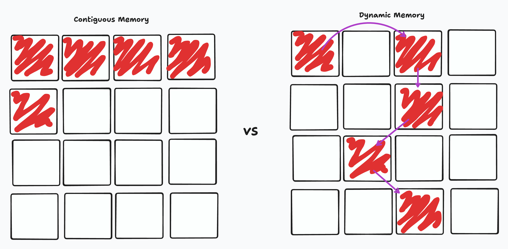

# Mastering Linked Lists

## Introduction

Today, we embark on an exciting journey into the world of linked lists. Linked lists are fundamental data structures that play a crucial role in programming. In this lesson, we'll explore why linked lists are essential, the challenges posed by traditional lists in memory, and how to create and manipulate linked lists efficiently.

## The Problem with Lists in Memory

1. **Static Memory Allocation:**
   - Traditional lists (arrays) require static memory allocation, meaning you need to specify the size in advance. (Static Languages)
   - This limitation can lead to wasted memory or insufficient space for dynamic data.

   ```python
   # Static memory allocation
   fixed_size_list = [0] * 100
   ```

2. **Inefficient Insertions/Deletions:**
   - Inserting or deleting elements in the middle of a list involves shifting subsequent elements, resulting in inefficiency.

   ```python
   # Inefficient insertion
   data = [1, 2, 3, 4, 5]
   # Inserting 10 at index 2 requires shifting elements
   data.insert(2, 10)
   ```

## What are Linked Lists

1. **Dynamic Data Structures:**
   - Linked lists overcome the limitations of static memory allocation by dynamically allocating memory as needed.

2. **Node-based Structure:**
   - Consists of nodes where each node contains data and a reference (or link) to the next node in the sequence.

   

## Linked Lists vs. Lists

1. **Memory Allocation and Efficiency:**
   - Linked List: Provides better memory utilization since each element is stored in a separate node, allowing for non-contiguous memory allocation.
   - List in Python: Stores elements in contiguous memory, which may lead to memory fragmentation and may be less efficient in terms of memory usage for small or frequently changing collections.

   

2. **Insertions/Deletions:**
   - Linked List: Insertions and deletions at arbitrary positions are more efficient because you only need to update the references in neighboring nodes.
   - List in Python: Inserting or deleting elements in the middle of a list requires shifting all subsequent elements, which can be time-consuming for large lists.

3. **Pointer-Based Navigation:**

   - Linked List: Allows easy and efficient traversal with simple pointer adjustments.
   - List in Python: Provides direct access to elements by index but may involve additional overhead for iterating through elements.

## How To Create a Linked List

### Creating a Simple Linked List

- Create a Node class to represent each element in the linked list. Each node should have data and a reference to the next node.

```python
class Node:
    def __init__(self, data):
        self.data = data
        self.next = None  # Reference to the next node

# Creating a linked list
node1 = Node(1)
node2 = Node(2)
node3 = Node(3)

node1.next = node2
node2.next = node3

# The linked list: 1 -> 2 -> 3
```

- Create a LinkedList class to manage the nodes. It should have a head, which points to the first node in the list.

```python
class LinkedList:
    def __init__(self):
        self.head = None
```

### Manipulating a Linked List

1. **Insertion at the Beginning:**
  
    ```python
        def insert_at_beginning(self, data):
            new_node = Node(data)
            new_node.next = self.head
            self.head = new_node
    ```

2. **Inset at the End:**
  
    ```python
        def insert_at_end(self, data):
        new_node = Node(data)
        if not self.head:
            self.head = new_node
            return
        last_node = self.head
        while last_node.next:
            last_node = last_node.next
        last_node.next = new_node
    ```

3. **Deletion:**
   - Deleting a node involves updating references to bypass the node to be deleted.

    ```python
    def delete_by_value(self, key):
        current_node = self.head
        if current_node and current_node.data == key:
            self.head = current_node.next
            current_node = None
            return
        prev_node = None
        while current_node and current_node.data != key:
            prev_node = current_node
            current_node = current_node.next
        if current_node is None:
            return
        prev_node.next = current_node.next
        current_node = None
    ```

4. **Traversal**

    ```python
    def print_list(self):
        current_node = self.head
        while current_node:
            print(current_node.data, end=" ")
            current_node = current_node.next
    ```

5. **Example**

    ```python
    # Example Usage
    linked_list = LinkedList()
    linked_list.insert_at_end(10)
    linked_list.insert_at_beginning(5)
    linked_list.insert_at_end(20)
    linked_list.print_list()  # Output: 5 10 20
    linked_list.delete_by_value(10)
    linked_list.print_list()  # Output: 5 20
    ```

## Conclusion

Linked lists offer a dynamic and efficient alternative to traditional lists. As you delve into more complex programming challenges, understanding linked lists will empower you to design scalable and memory-efficient solutions. Remember, the beauty of linked lists lies in their adaptability and responsiveness to dynamic data. Happy coding!
