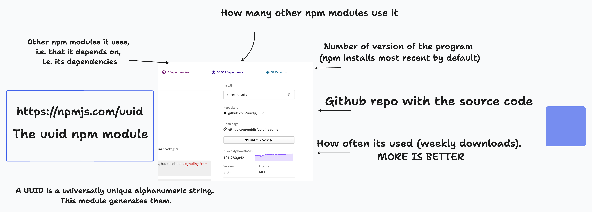
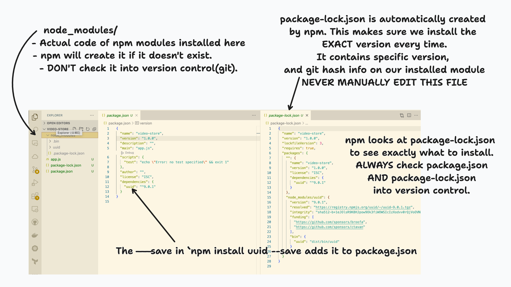
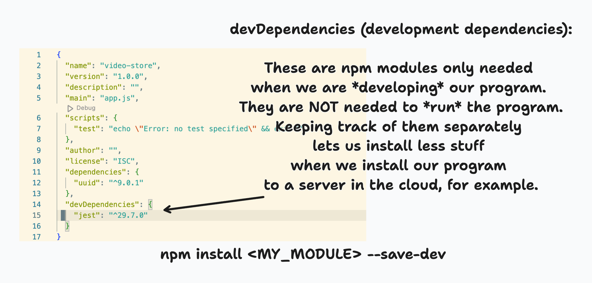

# Intro to the node project ecosystem

---

## aka

The agony and the ecstasy of:

- npm vs yarn
- package.json
- node projects
- CommonJS vs ESModules, i.e. require vs import/export

---

## in other words ...

Modern JS!

---


## TLO's - Hard Skills

---

### npm & node.js projects

- Create a new node project with npm
- Install npm modules as dependencies
- Create and run npm scripts
- Understand the standard node.js project structure  & best practice
- Run tests with jest
- Install & run an existing node.js project 

---

### JS Modules

- Recognize the old CommonJS module if you see it (`require()`)
- Import / export JS code with the preferred new ESModule
  - Using relative paths
  - Can do both named and default exports

---

## ELO's -- Concepts & Contextual Knowledge

---

### node.js

- Explain at a high level what node.js is and what it lets us do

### npm & node.js projects

- Be able to read and understand a package.json file

### JS Modules

- Able to explain why there are two module systems for JS and which one is preferred

---

## Table of Contents

1. What is node.js? Running JS in the browser vs node.js
2. Creating a new node.js project
3. Installing npm modules
4. Adding a test
4. npm scripts
5. Project structure & package.json
6. Tests
7. JS Modules - Importing and Exporting
8. Installing & running an existing node.js project

---

## What is npm

Node

Package

Manager

https://docs.npmjs.com/about-npm

---

### npm is 3 things

1. [The website](https://www.npmjs.com/) where you can search for public node.js modules to use. Such as the [uuid module](https://www.npmjs.com/package/uuid)
2. [The CLI program npm](https://docs.npmjs.com/cli/v10/commands/npm) you use to create node.js projects, install modules, and build/run/manage your projects.
3. [The registry](https://docs.npmjs.com/cli/v10/using-npm/registry) where all public the node.js module info is stored. This is what you search with the website. 

**The CLI tool npm is what we use most directly**

---

## Creating a new node.js project with npm

---

### Initial setup - create the project

First, create your project directory and navigate to it.

```bash
> mkdir video-store
> cd video-store
```

---

### Initialize the node project

Run this in our project root directory:

```bash
> npm init
``` 

Follow all the steps below.

1. For "package name" put `video-store`,  you will see why shortly.
2. **When it prompts you for an entry point**, put `app.js`
3. Just leave everything else blank and hit enter for now. If you want to experiment, feel free, it should not break anything.

---

### Entry point?

The npm init CLI asked us for an **entry point** -- this is the file path (which includes the file name) that node and npm will use when searching through files for dependencies (other files/modules we are importing, etc).

---

We set our entry point to `app.js`. Lets create that file now. Run this in your project root dir:

```bash
> touch app.js
```

Add this to `app.js`
```js
console.log('hello, world!)

function createStore() {
  return {
    customers: [],
    videos: [],
  }
}

console.log('video store is ', createStore())
```

---

... and then run:

```bash
> node app.js
```

We should see:

```bash
hello, world!
video store is  { customers: [], videos: [] }
```

---

We will discuss more what an "entry point" is later. Now let's talk about ...

---

### Installing npm modules

1. Look at the module on npmjs and on its github.

2. Look at its docs to see how to use it.

3. Install it with npm **and save it to the package.json file**.

4. Run some code to make sure we can use it correctly.

---

#### 1. Look at the [uuid module on npmjs](https://www.npmjs.com/package/uuid)



---

#### 2. Look at its docs to see how to use it

- The npm page for uuid points us to its github, [which has a quickstart in the README](https://github.com/uuidjs/uuid#quickstart)

- Usually but not always the github page for an npm module has instructions in the README on how to use it.

- Skip this step at your own peril.

---

#### 3. Install it and save it to  the `package.json` file.

```bash
> npm install --save uuid
```



---

#### Sidebar: package.json and node_modules/

- `npm init` creates it.
- It is a normal JSON file that is treated in a special way by npm.
- It must always be in the **root directory** of the project.
- Every node module must have one. Every project where you use npm must have one.

---

- It can do a LOT of stuff. Most critically:
  - dependencies
  - scripts
  - project info
- npm automatically creates `package-lock.json` when you install a module.
- package-lock.json has the **specific** version info of a module.

---

- The `node_modules/` directory is where the code of an npm module actually gets installed.
- Never modify it directly.
- Don't check it into version control - use a `.gitignore file`
- Always check `package.json` and `package-lock.json` into version control.

---

#### 4. Run some code to make sure things work

Add this to `app.js`

```javascript
const uuid = require('uuid');

const uuidv4 = uuid.v4;

console.log('hello, world!') // THIS WAS ALREADY IN OUR CODE
const myUUID = uuidv4(); // Create a version 4 UUID
console.log('uuid is ', myUUID);

// ... all our other code is below this line ...

```

- Require or Import statements MUST be at the top of the file.
- Put the other code right after our 'hello world'. Not required but recommended.
- The `require` is a CommonJS module way of importing. This is the **old** way. We'll see the new way - ESModules - in a bit.

---

Our output should be:

```bash
> node app.js
hello, world!
uuid is  ce9f46f1-5b50-4ca8-94f5-60146367e847
video store is  { customers: [], videos: [] }
```

*Note: Your actual uuid value will be different*

---

Just to wrap things up lets do something useful with our uuid module! Add this code to `app.js`

```javascript
function createCustomer(name) {
  return {
    name: name.toLowerCase(),
    id: uuidv4(),
  }
}

console.log('new customer ', createCustomer('Alice'));
```

Output for this new code should be:

```bash
new customer { name: 'alice', id: 'ce9f46f1-5b50-4ca8-94f5-60146367e847' }
```

*Note: your uuid value will be different.*

---

### Adding tests & intro to npm scripts

1. [Install jest](https://www.npmjs.com/package/jest)
2. Write a test for `createStore()`
3. Run it
4. Use an npm script to run it
5. Refactor our project to have `src/` and `test/` directories.
6. Write another test just for fun.

---

#### 1. Install jest

```bash
> npm install --save-dev jest

```

... wait a minute - what is `--save-dev` ?

---

#### Sidebar: devDependencies

When we run `npm install <MY_MODULE> --save-dev, the module info is added to `package.json` under `devDependencies`, NOT `dependencies`.

---




---


### Sidebar

#### what is an npm module?

---

An npm module or *node module* is a standard format for sharing Javascript **projects** (a collection of files, essentially) that use node.js and npm or another node package manager like yarn.

An npm module **must** contain a `package.json` file.

---

An npm module can be *published*, either publicly to the [npmjs registry](https://www.npmjs.com/) or privately.

We didn't do it this time but by modifying your `package.json` file you can control this, and, tell npm to look for a specific git repository, etc, when a user wants to install your module.

---

When we run `npm install my-module`, npm checks the npmjs server to see where to go (usually a github repo) to get the source code for that module.

---

#### Back to - what is an entry point?

We set our entry point to `app.js`

**If someone else has downloaded our module using `npm install`, and then uses `require` to import and run our module in their program - this is the file that gets run.**

**Like so ...**

---


*example of another person using our program in their code*

```js
// runs our program by executing whatever is in `app.js`
// Note that they use the *name* of our npm module, which we specified
// when we ran `npm init`
const videoStore = require(video-store);

// lets pretend our module actually does stuff ...
videoStore.addCustomer('Alice');
```

---

### Best practice -- Getting oriented

For a new project, always get oriented.

---

It's always a good idea to take a few minutes to look at the config files and directory structure of a new project. Let's do that now.

---

#### package.json

Look at the `package.json` file. This was created when we ran `npm init`. We don't have to modify it yet, just check it out. It is a good habit to always look at the `package.json` file of a project to get a sense of its structure, dependencies, and npm scripts.

---

#### .gitignore

Look at the `.gitignore` file. Wait! We don't have that yet - it doesn't exist. Why do we want one?

- The `.gitignore` file tells whatever git repo (ie whatever directory) its in to *ignore* certain files and folders.

Why do we want to do that?

---

##### Stuff we want to ignore

- Log files with error messages and such, which we don't want to check into version control (put into our projects github).

- *Dependencies* - other programs we install. Like node modules.
  - We want a **list** of the dependency names - this goes in `package.json`
  - But the dependencies themselves ...
    - We want to be able to grab the newest version.
    - They can get big.

---

##### Best Practice

Don't check dependencies (modules or libraries you install with a package manager) into version control.

They take up space, and you often want to grab the latest version.

Instead, check the **dependency name and version** into version control.

- In JS with npm this is done in `package.json`
- In Python with pip this is done in `requirements.txt`

---

#### ... Back to creating that `.gitignore` file:


```bash
> echo 'node_modules' >  .gitignore
```

This creates the file and appends "node_modules" to it.
You can run these commands to confirm the file was created correctly and contains what it should:

```bash
ls -a 
cat .gitignore
```

---

### Wait ... node_modules?

The `node_modules/` directory is where our *dependencies* - npm packages (aka node modules) get installed. We will investigate this more shortly.

---


(which was included in this repo). When you create a github repo you can choose a default `.gitignore` file and one option is specifically for node.js projects, which is what was used here.

---

Note that the `node_modules/` directory is in there, which means that git will ignore everything in `node_modules/`. This is good, as we don't want to check dependencies into version control.

---

### Creating a 'start' npm script

Now lets modify `package.json`. We are going to add an *npm script* we can call to run our program for us.

**For node projects this script is always called "start"**.

---

Modify the `scripts` object so it has a property named `start`. It should look more-or-less like the code below.

*** IMPORTANT *** **Don't forget to add a comma at the end of the "test" line of code**

```json
  "scripts": {
    "test": "echo \"Error: no test specified\" && exit 1",
    "start": "node app.js"
  },
```

---

As your node projects become more complex, this is a standard practice. Many frontend build tools, like *vite* or *create-react-app* actually do this for you.