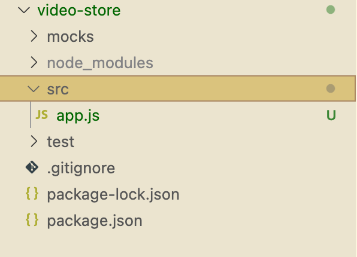
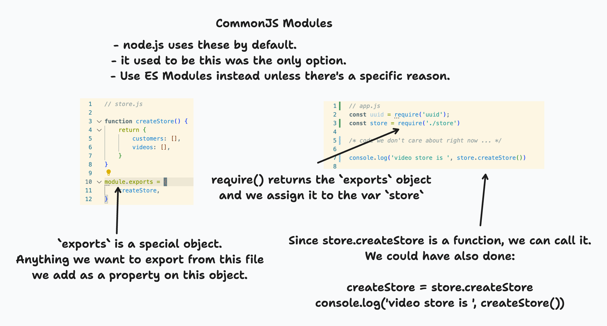

# Node.js projects, npm, and Importing/Exporting

---

## Table of Contents

1. [What is npm](#what-is-npm)
2. [Creating a new node.js project](#creating-a-new-nodejs-project)
3. [Installing npm modules & importing with CommonJS](#installing-npm-modules)
4. [Node.js project structure](#nodejs-project-structure)
5. [npm scripts](#npm-scripts)
6. [Adding a test & Installing a devDependency](#adding-a-test-and-devdependencies)
7. [Importing and Exporting with ES6 Modules](#importing-and-exporting-with-es6-modules)
8. [Using an existing node.js project](#using-an-exising-nodejs-project)

---

## TLO's - Hard Skills

- Create a new node project with npm
- Install npm modules as dependencies
- Basic use of Import/Export with CommonJS modules
- Run tests with jest
- Understand the standard node.js project structure  & best practice
- Create and run npm scripts
- Import/Export code with ES6 Modules as both default and named exports
- Install & run an existing node.js project

---

## ELO's -- Concepts & Contextual Knowledge

- Be able to read and understand a package.json file
- Able to identify the two different module systems (CommonJS/ES6Modules) and which is preferred/best practice.

---

## What is npm

Node

Package

Manager

https://docs.npmjs.com/about-npm

---

### npm is 3 things

1. [The website](https://www.npmjs.com/) where you can search for public node.js modules to use. Such as the [uuid module](https://www.npmjs.com/package/uuid)
2. [The CLI program npm](https://docs.npmjs.com/cli/v10/commands/npm) you use to create node.js projects, install modules, and build/run/manage your projects.
3. [The registry](https://docs.npmjs.com/cli/v10/using-npm/registry) where all public the node.js module info is stored. This is what you search with the website. 

**The CLI tool npm is what we use most directly**

---

## Creating a new node.js project

1. Create project dir.

2. Initialize the project - run `npm init` to create a `package.json` file.

3. Create our entrypoint file and run a "hello world" check.

---

### 1. Initial setup - create the project

First, create your project directory and navigate to it.

```bash
> mkdir video-store
> cd video-store
```

---

### 2. Initialize the node project

Run this in our project root directory:

```bash
> npm init
``` 

Follow all the steps below.

1. For "package name" put `video-store`,  you will see why shortly.

2. **When it prompts you for an entry point**, put `app.js`

3. Just leave everything else blank and hit enter for now. If you want to experiment, feel free, it should not break anything.

---

### 3. Entry point?

The npm init CLI asked us for an **entry point** -- this is the file path (which includes the file name) that node and npm will use when searching through files for dependencies (other files/modules we are importing, etc).

---

We set our entry point to `app.js`. Lets create that file now. Run this in your project root dir:

```bash
> touch app.js
```

Add this to `app.js`
```js
console.log('hello, world!)

function createStore() {
  return {
    customers: [],
    videos: [],
  }
}

console.log('video store is ', createStore())
```

---

... and then run:

```bash
> node app.js
```

We should see:

```bash
hello, world!
video store is  { customers: [], videos: [] }
```

---

## Installing npm modules

1. Look at the module on npmjs and on its github.

2. Look at its docs to see how to use it.

3. Install it with npm **and save it to the package.json file**.

4. Run some code to make sure we can use it correctly.

---

### 1. Look at the [uuid module on npmjs](https://www.npmjs.com/package/uuid)


---

### 2. Look at its docs to see how to use it

- The npm page for uuid points us to its github, [which has a quickstart in the README](https://github.com/uuidjs/uuid#quickstart)

- Usually but not always the github page for an npm module has instructions in the README on how to use it.

- Skip this step at your own peril.

---

### 3. Install it and save it to  the `package.json` file.

```bash
> npm install --save uuid
```


---

### 4. Run some code to make sure things work

Add this to `app.js`

```javascript
const uuid = require('uuid');

const uuidv4 = uuid.v4;

console.log('hello, world!') // THIS WAS ALREADY IN OUR CODE
const myUUID = uuidv4(); // Create a version 4 UUID
console.log('uuid is ', myUUID);

// ... all our other code is below this line ...

```

---

Our output should be:

```bash
> node app.js
hello, world!
uuid is  ce9f46f1-5b50-4ca8-94f5-60146367e847
video store is  { customers: [], videos: [] }
```

*Note: Your actual uuid value will be different*

---

Just to wrap things up lets do something useful with our uuid module! Add this code to `app.js`

```javascript
function createCustomer(name) {
  return {
    name: name.toLowerCase(),
    id: uuidv4(),
  }
}

console.log('new customer ', createCustomer('Alice'));
```

Output for this new code should be:

```bash
new customer { name: 'alice', id: 'ce9f46f1-5b50-4ca8-94f5-60146367e847' }
```

*Note: your uuid value will be different.*

---

### Sidebar: `package.json`

- `npm init` creates it.
- It is a normal JSON file that is treated in a special way by npm.
- It must always be in the **root directory** of the project.
- Every node module must have one. Every project where you use npm must have one.

---

- It can do a LOT of stuff. Most critically:
  - dependencies
  - scripts
  - project info
- npm automatically creates `package-lock.json` when you install a module.
- package-lock.json has the **specific** version info of a module.

---

### Sidebar: `node_modules/`

- The `node_modules/` directory is where the code of an npm module actually gets installed.
- Never modify it directly.
- Don't check it into version control - use a `.gitignore file`
- Always check `package.json` and `package-lock.json` into version control.

---

### Sidebar: What is an npm module?

---

An npm module or *node module* is a standard format for sharing Javascript **projects** (a collection of files, essentially) that use node.js and npm or another node package manager like yarn.

An npm module **must** contain a `package.json` file.

---

An npm module can be *published*, either publicly to the [npmjs registry](https://www.npmjs.com/) or privately.

We didn't do it this time but by modifying your `package.json` file you can control this, and, tell npm to look for a specific git repository, etc, when a user wants to install your module.

---

When we run `npm install my-module`, npm checks the npmjs server to see where to go (usually a github repo) to get the source code for that module.

---

### Sidebar: `require()`

- ALWAYS put Require or Import statements at the top of the file.
- The `require` is a CommonJS module way of importing. This is the **old** way. We'll see the new way - ES6Modules - in a bit.
- `require()` is becoming outdated but every now and then you need to use it. After today, you should avoid it.

---

## NodeJS Project Structure

1. Always add a `.gitignore` file

2. Always add a README.

3. Create `src/`, `tests/`, and `mocks/` dirs.

4. Don't clutter `app.js` -- code you re-use (import/export) should go in different files.

---

### 1. Always add a .gitignore file

Let's look at our `.gitignore` file. Wait! We don't have that yet - it doesn't exist. Why do we want one?

- The `.gitignore` file tells whatever git repo (ie whatever directory) its in to *ignore* certain files and folders.

Why do we want to do that?

---

#### Stuff we want to ignore

- Log files with error messages and such, which we don't want to check into version control (put into our projects github).

- *Dependencies* - other programs we install. Like node modules.
  - We want a **list** of the dependency names - this goes in `package.json`
  - But the dependencies themselves ...
    - We want to be able to grab the newest version.
    - They can get big.

---

#### Best Practice

- Don't check dependencies into version control.

- They take up space, and you often want to grab the latest version.

- Instead, check the **dependency name and version** into version control.

- For node.js projects this is done with `package.json` and `package-lock.json`

---

#### ... Back to creating that `.gitignore` file:

```bash
> echo 'node_modules' >  .gitignore
```

This creates the file and appends "node_modules" to it.
You can run these commands to confirm the file was created correctly and contains what it should:

```bash
> ls -a 
> cat .gitignore
```

---

### 2. Always create a README

- `README.md` should go in the project root dir - the same dir `package.json` is in
- It should contain a brief description of the project.
- It should contain **instructions on how to install and run the project.**

---

```bash
> touch README.md
```

Add something like ...

```markdown
# Video store

A video store program.

## Installing
1. Clone this project
2. Run `npm install`

## Running
To run, run `npm start`
```

- We will shortly what `npm start` is.

---

### 3. Create `src/`, `tests/`, and `mocks/` dirs

```bash
> mkdir src tests mocks
> ls
> mv app.js srcs/
> ls srcs/
```

---



- Source code (our program) goes in `src/`
- Test code goes in `tests/`
- Mock data (sample data) goes in `mocks/`

---

### 4. Don't clutter `app.js` -- code you re-use (import/export) should go in different files

- Keeps our code organized.
- Makes it easier to import functions, etc, to test.
- Makes `app.js` easier to read and understand.

---

1. Move `createStore()` into it's own file.
2. Export it the old way (CommonJS Module)
3. Import the old way into `app.js`
4. Rinse and repeat with `createCustomer()`

---

#### 1. Move `createStore()` into it's own file

```bash
> touch src/store.js
> code src/store.js
```

```javascript
// store.js

function createStore() {
    return {
        customers: [],
        videos: [],
    }
}
```

---

#### 2. Export it the old way (CommonJS Module)

```javascript
// store.js

function createStore() {
    return {
        customers: [],
        videos: [],
    }
}

// This is an object. createStore() is a property on it. 
// When we call `require('./store.js)` in another file, 
// it **returns** this object!
module.exports = {
  createStore // shorthand for `createStore: createStore`
}
```

---

#### 3. Import the old way into `app.js`

```javascript
const uuid = require('uuid');
const store = require('./store')

/* other code we don't care about right now ... */

console.log('video store is ', store.createStore())
```

Make sure it works:

```bash
> node src/app.js
```

---

#### How CommonJS import/export works



---

#### 4. Rinse and repeat with `createCustomer()`

- Create a file named `src/customer.js`
- Move the `createCustomer()` function into it from `src/app.js`
- Export it from `src/customer.js` and into `src/app.js` like we did with `createCustomer()`
- Run `src/app.js`

**Did you get an error?**

```bash
ReferenceError: uuidv4 is not defined
```

*What extra step do we have to do?*

---

## npm scripts

---

### Creating a 'start' npm script

Now lets modify `package.json`. We are going to add an *npm script* we can call to run our program for us.

**For node projects this script is always called "start"**.

---

Modify the `scripts` object so it has a property named `start`. It should look more-or-less like the code below.

*** IMPORTANT *** **Don't forget to add a comma at the end of the "test" line of code**

```json
  "scripts": {
    "test": "echo \"Error: no test specified\" && exit 1",
    "start": "node app.js"
  },
```

---

As your node projects become more complex, this is a standard practice. Many frontend build tools, like *vite* or *create-react-app* actually do this for you.

---

## Adding a test and devDependencies

1. [Install jest](https://www.npmjs.com/package/jest)
2. Write a test for `createStore()`
3. Run it
4. Use an npm script to run it
5. Refactor our project to have `src/` and `test/` directories.
6. Write another test just for fun.

---

### 1. Install jest

```bash
> npm install --save-dev jest

```

... wait a minute - what is `--save-dev` ?

---

### Sidebar: devDependencies

```bash
> npm install <MY_MODULE> --save-dev 
```

When we run this, the module info is added to `package.json` under `devDependencies`, NOT `dependencies`.

---


---

### 2. Write a test for `createStore()`

---

## Importing and Exporting with ES6 Modules

1. Modify package.json so we can use ES6 Modules

2. Refactor our existing code

3. Default exports vs named exports

4. Absolute vs relative paths

---

## Using an exising NodeJS project

1. Read the README

2. Clone the project if its on github.

3. Install npm modules with `npm install`

4. Get oriented.

5. Run it to make sure it works.

---

### Best practice -- Getting oriented

For a new project, always get oriented.

---

It's always a good idea to take a few minutes to look at the config files and directory structure of a new project. Let's do that now.

---

#### package.json

1. What `dependencies` and `devDependencies` are there?

2. What npm scripts are there?

3. Are ES6 modules enabled for this project?

---