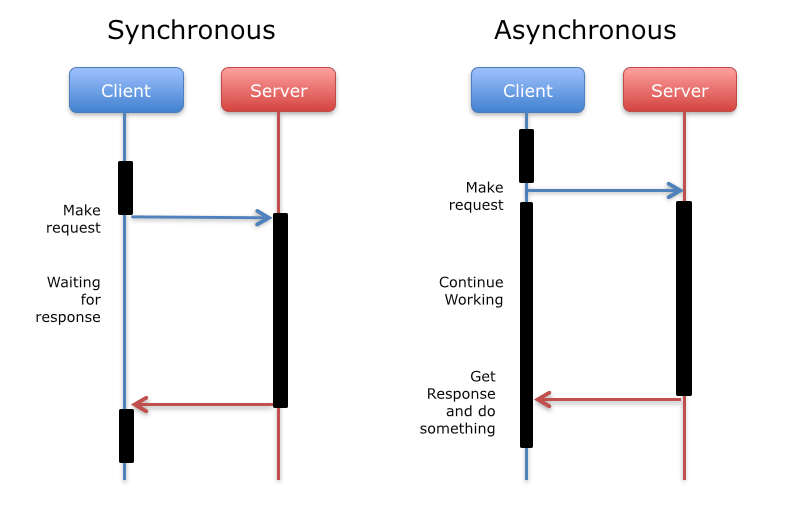
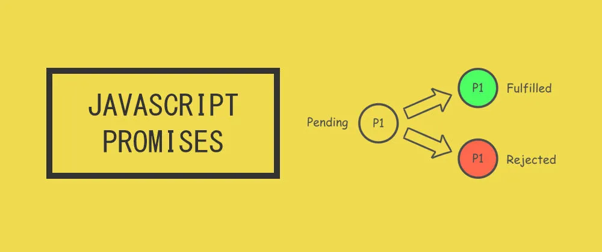

# Async in JS + React

## Topics Covered

- What are we trying to accomplish?
- Sync vs Async and why it matters
- Request-Response Cycle + React
- Async in vanilla JS
- Callbacks
- Promises
- Async in React with `useEffect`
- A more complex `useState` example
- `useEffect` and `<input>`
- Upgrading from Promises to Async/Await (syntax sugar)

- Video store features pt 3:
  - Use the [OMDb API](https://www.omdbapi.com/) (open source movie info api)
  - Use this API key: 7f539340 ([get own api key here](https://www.omdbapi.com/apikey.aspx))
  - Example query: GET http://www.omdbapi.com/?i=tt3896198&apikey=7f539340 => JSON
- Assignment
  - Build day 3 features

## Lesson

### What are we trying to accomplish?

This lesson ends up digging in deeply into the concept of `async` in JavaScript, so first let's see what we are actually building to by looking at our end goal.

Open the project at [use-effect-example](./examples/use-effect-example/), install dependencies (`npm install`) and run the dev server `npm run dev`. You should see a page like below:


This is the lesson where we add functionality to work with APIs to React!

If we look in the code at [PokeViewer](./examples/use-effect-example/src/components/PokeViewer.jsx) you will notice we are using a new hook, called `useEffect`. This is how React adds functionality to work with backend APIs, your own or someone else's. But let's take a look inside the body of our `useEffect` for a moment:

```js
axios.get(`https://pokeapi.co/api/v2/pokemon/${name}`).then((response) => {
  const sprites = response.data.sprites;
  const spriteUrls = Object.values(sprites).filter(
    (sprite) => typeof sprite === "string"
  );
  setPokeImgUrls(spriteUrls);
});
```

This is something we haven't seen yet. `axios` is a JS library used for making requests to some backend API, but it utilizes a JS pattern called `Promises`. `Promises` are a way of representing _`asynchronous`_ actions, like making a request to a backend API, and then to handle the response effectively. We will build to accomplishing this in React today using the `useEffect` hook, but we are going to want to build up to that, first by discussing the concept of `async` in JS itself, then looking at Promises, then finally looking at using it in React with `axios` and `useEffect`.

### Sync vs Async and why it matters

Imagine someone is scrolling through your website, we would want this to execute immediately right? Otherwise there would be a visual lag.

Now imagine someone clicks on a button on the page, and this triggers an HTTP request, which takes 2 minutes to return. Now if that call was sync, could the user scroll through the page in the meantime?

**NO!** Sync means we aren't done until we finish executing the most recent action. Without async, websites would essentially freeze while waiting for a request to return a response. That is a somewhat reasonable approach on one's own computer (and the reason why some 'expensive' tasks end up with a spinning wheel - wait this is taking awhile!) but for talking to other computers over the internet the time between request and response can be very long depending on the quality of your connection. So the solution is to trigger the request _asynchronously_, include some logic to trigger on response, then immediately go back to executing whatever the next syncronous task is.



This is why async-first is a **_necessary_** design choice for client-side development, ie JavaScript.

### Async in vanilla JS

Before seeing this in React, let's dive a little deeper into the concept of async in basic JS. Async is an idea that is baked in pretty deeply into JS (unlike Python) and so understanding it's behavior is key to understanding any future idea based on it, like Promises. Lets use the code example located at [examples/async-vanilla-js/1-async-as-concept.js](./examples/async-vanilla-js/1-async-as-concept.js) along with the website [jsv9000](https://www.jsv9000.app/) to see how JS evaluates sync vs async code differently.

**In summary:** what happened here?

1. Program is run, begins executing code line by line.
2. Encounters some function definitions and defines it in memory (sync).
3. A call to `sayMyNameA()` is encountered and executed (sync).
4. Encounters call to `setTimeout`. `setTimeout` is a special function that allows us to set up async tasks. It's first argument `sayMyNameB` doesn't get added to the Call Stack, rather, it gets added to a seperate list called the Event Queue (or Task Queue) with an associated timer set to 2000 ms (the second argument), which starts counting down immediately.
5. `sayMyNameC()` is executed (sync).
6. Another `setTimeout` is encountered, adds `sayMyNameD` to the Task Queue, with an associated timer of 0 ms. Note that doesn't mean it executes after 0 ms, this only matters in comparsion to other events in the Task Queue.
7. `sayMyNameE()` is executed (sync).
8. The call stack is now empty and we are at the end of the file, so all sync code is done.
9. async execution phase begins. The first thing we dequeue from the Task Queue is not the first thing added to it, but the first thing 'done', so that's the 0 ms case, `sayMyNameD()`.
10. The next thing evaluated is `sayMyNameB()`
11. With both the call stack and task queue completely empty, the program is truly done

Our expected output order is then:

1. Alpha
2. Charlie
3. Echo
4. Delta
5. Bravo

This is the essential difference between async/sync, whether the associated function gets executed right away (Call Stack) or is added to the Event Queue to get executed later (there can be other triggers besides a timer).

### Callbacks

Callbacks are the original way to work with async, which just means passing a function to another function to be executed later, like we did with `setTimeout` in the previous example. However this doesn't scale well, because it has no built in way to work deal with two important situations:

1. Chaining async actions - what if I want to do something async, get a response, and use that to trigger something else async? This is very common in web dev, as the response of one api call might inform the request to another.

2. Error handling - related to chaining, how do we handle errors and bubble them up to the original caller?

### Promises

`Promises` aim to solve both of the issues with callbacks with a specific API. Usually you will not define your own Promises, but it's worth seeing how to do so to understand how they work.

A Promise is a specific type of object that takes a single parameter, a function that itself takes two parameters, themselves also functions, called resolve and reject. The promise begins in the state 'pending' and irrevocably moves to either the 'resolved' or 'rejected' state based on which one of those functions is called, along with a 'payload' of some kind.



Once again, let's use the code located at [examples/async-vanilla-js/2-async-with-promises.js](./examples/async-vanilla-js/2-async-with-promises.js) along with the website [jsv9000](https://www.jsv9000.app/) to see how Promises work.

### Async in React with `useEffect`

Whew! That was a deep dive into async in JS, but how does this relate to React? As a frontend framework, React expects you want to make backend calls, and you accomplish this in modern React with the `useEffect` hook. Let's look at a simplified version of the example at [UseEffectBasic.jsx](./examples/use-effect-example/src/components/UseEffectBasic.jsx)

```jsx
import { useEffect } from "react";
import axios from "axios";

export default function UseEffectBasic() {
  useEffect(() => {
    axios.get(`https://pokeapi.co/api/v2/pokemon/pikachu`).then((response) => {
      console.log(response.data);
    });
  }, []);

  return <div>Use Effect Basic Component</div>;
}
```

So what are the basics of `useEffect`?

First, `useEffect` is a `hook`, meaning it must be called at the top level of the component, and nowhere else!

Second, let's look at the parameters `useEffect` takes. There are two.

1. The first is a callback function that takes no inputs. This is what will be called when the useEffect is _triggered_.

2. The second is so short you could almost miss it! In this case its `[]`, the empty list. This is what React calls a _dependency list_. The body of the useEffect will be triggered every time something in this list changes! This can be combined with useState then to trigger new requests when some state variable is updated.

There are a few different cases then with the dependency list:

1. no dependency list: if you leave the dependency list parameter out entirely React will trigger the `useEffect` on _every render_. This can be very dangerous and create infinite rerender loops, so be careful, do not default to this!

2. an empty list, `[]`: this means only trigger after the first render, then never again. This should be your default.

3. a list with one element, `[name]`. A list like this would retrigger the `useEffect` if the value of `name` were ever to change. Useful in conjunction with an input for example.

4. a list with multiple elements, `[name, age]`. This would retirgger the `useEffect` if _any_ of the values changed.

Also note, `useEffect` always runs _after_ a given render, so the component is rendered first, and then the useEffect is triggered, meaning you always need to account for what the component looks like before any response happens.

### A more complex `useState` example

Let's see a more 'real world' `useState` example with the code at [PokeViewer](./examples/use-effect-example/src/components/PokeViewer.jsx)

```js
import { useState, useEffect } from "react";
import axios from "axios";

export default function PokeViewer({ name }) {
  // first create some placeholder state
  const [pokeImgUrls, setPokeImgUrls] = useState([]);

  // This will run *after* each render
  // first arg is callback function
  // second arg is dependency list
  // If empty means 'just once after first render'.
  // If left out means 'after every render' (usually not what you want, easy to become infinite loop)
  useEffect(() => {
    // do async logic here
    axios.get(`https://pokeapi.co/api/v2/pokemon/${name}`).then((response) => {
      const sprites = response.data.sprites;
      const spriteUrls = Object.values(sprites).filter(
        (sprite) => typeof sprite === "string"
      );
      setPokeImgUrls(spriteUrls);
    });
  }, []);

  return (
    <>
      <h2>{name}</h2>
      <div>
        {pokeImgUrls.length > 0 ? (
          <div>
            {pokeImgUrls.map((url, index) => (
              
            ))}
          </div>
        ) : (
          <div>Loading...</div>
        )}
      </div>
    </>
  );
}
```

Some things to note:

1. We utilize a related `useState` to keep track of the fetched data, and begin it in some empty state so we know it hasn't happened yet.

2. In returned jsx we check this value first and render `<div>Loading...</div>` if it hasn't appeared yet. You might not be able to see this happen, but on a slower connection you would.

3. After the first render the `useEffect` is triggered. We are then parsing the returned data on success to make sure we save just the data we want to our associated `useState`.

4. When `setPokeImgUrls` is called with new data, it triggers a rerender, which means the returned jsx will now reflect that new data visually.

### `useEffect` and `<input>`

Let's see one final example where we integrate `useEffect` with an input. Our example is the component [PokeSearch](./examples/use-effect-example/src/components/PokeSearch.jsx)

```js
import { useEffect, useState } from "react";
import axios from "axios";

export default function PokeSearch() {
  const [inputValue, setInputValue] = useState("");
  const [pokeSearchName, setPokeSearchName] = useState("");
  const [pokeImg, setPokeImg] = useState(null);
  const [errorMsg, setErrorMsg] = useState("");
  const [loading, setLoading] = useState(false);

  const onClickHandler = () => {
    setPokeSearchName(inputValue);
    // blank out other data when triggering new call
    setInputValue("");
    setPokeImg(null);
    setErrorMsg("");
  };

  useEffect(() => {
    // necessary otherwise would trigger initially
    if (pokeSearchName.length > 0) {
      // set loading state on start
      setLoading(true);
      // make the call and handle success/failure
      axios
        .get(`https://pokeapi.co/api/v2/pokemon/${pokeSearchName}`)
        .then((response) => {
          setPokeImg(response.data.sprites.front_default);
        })
        .catch((error) => {
          setErrorMsg(error.message);
        })
        // don't forget to reset loading state either way
        .finally(() => setLoading(false));
    }
  }, [pokeSearchName]);

  return (
    <>
      <input
        type="text"
        value={inputValue}
        onChange={(event) => setInputValue(event.target.value)}
      />
      <button onClick={onClickHandler}>Search</button>
      <div>
        {loading && <div>Loading ...</div>}
        {pokeImg && }
        {errorMsg && <pre>{errorMsg}</pre>}
      </div>
    </>
  );
}
```

There's a number of things happening here. We are using various `useState` variables to manage the state of the app, and whenever the user clicks 'search' we update the `pokeSearchName` with the current `inputValue`, which triggers a new `useEffect` call because of the dependency list.

Note how we use a guard in our `useEffect` logic to prevent triggering when the pokeSearchName is (initially) empty, and how we use the body of the `useEffect` and the `.catch` and `.finally` clauses to handle loading and error states.

### Upgrading from Promises to Async/Await (syntax sugar)

You have likely seen the `async/await` syntax by now. It is simply syntax sugar for Promises. It's important you understand Promises first before becoming reliant on async/await because it is still Promises under the hood.

With `async/await` we get nothing new but it can be easier to read async code top to bottom as if it was sync.

Example at [PokeSearchAsyncAwait](./examples/use-effect-example/src/components/PokeSearchAsyncAwait.jsx)

The only thing that has changes is the body of the `useEffect`:

```js
useEffect(() => {
  async function searchPokeApi() {
    if (pokeSearchName.length > 0) {
      setLoading(true);

      try {
        const response = await axios.get(
          `https://pokeapi.co/api/v2/pokemon/${pokeSearchName}`
        );
        setPokeImg(response.data.sprites.front_default);
      } catch (error) {
        setErrorMsg(error.message);
      } finally {
        setLoading(false);
      }
    }
  }

  searchPokeApi();
}, [pokeSearchName]);
```

What changed?

1. The `async` keyword needs to be attached to any function that wants to use `await`. This can't be used at the top level of the useEffect (for obscure reasons) so you need to define and call the async function from inside the body of the `useEffect` if you desire to use `async/await`.

2. Within the body of the `async` function the `await` keyword is used to 'pause' execution until the Promise resolves or rejects, which can make the flow look more natural compared to `.then` Promise syntax

3. Error handling or `.finally` logic can be replaced with a try/catch/finally block.

## Assignments

Integrate `useEffect` into the results from yesterday's assignment

[video-store-pt-3](https://classroom.github.com/a/XCapgurB)
