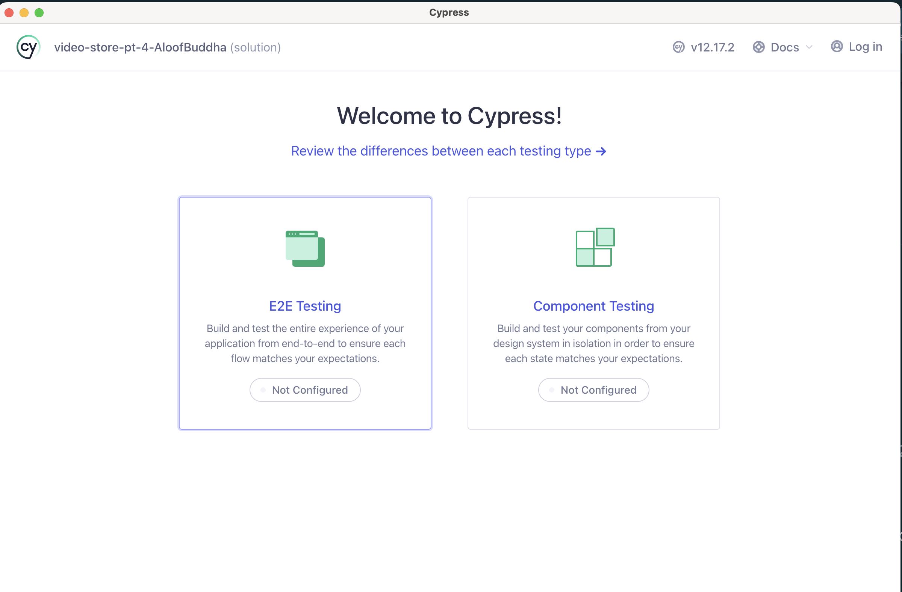

# Testing React

## Topics Covered / Goals

- Review of Unit Tests
- Testing a Front End App with unit tests
- End-to-end (e2e) tests as an alternative to unit tests
- Comparison of unit vs e2e tests
- Introducing `cypress`
- Writing/Running Tests in Cypress
- Essential Cypress Commands
- Testing Routes
- Multi-step Tests

## Lesson

### Review of Unit Tests

The purpose of this lesson is to introduce you to the testing framework we utilize for autograding for the upcoming React-based assessment, assessment-4.

Up until now, we have only seen one kind of test, `unit tests`. `Unit tests` are tests that guarantee some function works as expected by providing specific input to the function and checking that the produced output matches expectations.

A (contrived) example unit test might look like:

```js
import { describe, it, expect } from "vitest";
import { add, subtract } from "./MathFunctions.js";

describe("My math functions work", () => {
  it("1 + 1 = 2", {
    expect(add(1, 1)).toEqual(2);
  });

  it("2 + 3 = 5", {
    expect(add(2, 3)).toEqual(5);
  });

  it("1 - 4 = -3", {
    expect(subtract(1, 4)).toEqual(-3);
  });
});
```

There's a few parts to this:

1. There's the import statement where we import our own functions that we want to test.

2. There's the `testing framework`. There are a number of these such as [`mocha`](https://mochajs.org/) or [`jest`](https://jestjs.io/). This is the part that gives you the basic framework for creating tests, so in our example that's where the `describe` and `it` functions come from. These are just means to organize tests so they can be run by a command like `mocha` or `jest` and you usually don't need to import them as these testing frameworks provide the definitions automatically.

3. Seperate from the `testing framework` there is a sister library like [`chai`](https://www.chaijs.com/) that acts as an `assertion library`. The assertion library provides a specific way to check whether some output fits expectations.

In summary: a unit test imports some function we ourselves created. We then set up some test scaffolding with a testing framework like `mocha`. Each individual test (`it`) will then call our function with specific inputs and check its output against some expected output. We could do this manually, but an assertion library like `chai` gives us a convenient API for doing such a thing, and works alongside the testing framework to determine if a given test passed or failed.

### Testing a Front End App with unit tests

How might this apply to front-end testing, what would this look like?

Well, a given React component is defined as a function, it's input is props, and it's output is jsx. So theoretically we could define a test that renders a specific React component in isolation and makes sure that, given some props, specific HTML is the output.

There are some libraries that help with this, like `react-test-renderer`. Let's look at an example:

```js
import { describe, it, expect } from "vitest";
import { TestRenderer } from "react-test-renderer";
import HomePage from "../components/HomePage";

// imagine HomePage is defined like:
//
// export default function HomePage() {
//   return (
//     <div>
//       <h1>HOME</h1>
//     </div>
//   );
// }

describe("HomePage.jsx", () => {
  it("will have an h1 element with the text of 'HOME' as the first child", () => {
    const homePage = TestRenderer.create(<HomePage />).toJSON();

    // homePage now has contents = {
    //   tag: "div",
    //   children: [
    //     {
    //       tag: "h1",
    //       children: ["HOME"]
    //     }
    //   ]
    // }

    expect(homePage.children[0].children[0]).toBe("HOME");
  });
});
```

This theoretically works, we used the function `TestRenderer` to 'render' our `<HomePage />` component, which outputs HTML, which we then converted to JSON. Then we can parse that JSON to check that specific elements appear as expected.

There's some major problems with this approach however:

1. It's _brittle_. Our test expects very specific output and is likely to fail if the HTML structure `<HomePage />` outputs changes in the future.

2. More importantly, this approach _only allows us to test components in isolation_. What if what we want to test involves the behavior associated with clicking buttons or `useState` or `useEffect` behavior, or the expected routing output of `react-router`?

It is possible to test these things with a unit test approach like `react-test-renderer`, but you end up needing to do a lot of tricky mocking.

### End-to-end (`e2e`) tests as an alternative to unit tests

If you think about it for a minute, how do _you_ manually test your frontend app? The answer is likely by visiting the associated url in a browser, clicking around, and ensuring that after some set of actions are taken, the page looks the way you expect.

This is actually a different _type_ of test, not a `unit test` but an **_`end to end test`_**, also known as an **_`e2e test`_**. Unlike a unit test, an `e2e test` actually mocks the entire environment of the browser, and simulates an actual users experience. This tends to be a much better fit for testing front-ends.

We will get into the details in a moment, but for comparsion, the same test above written as an e2e test might look like:

```js
describe("Home Page", () => {
  it("will have an h1 element with the text of 'HOME' as the first child", () => {
    cy.visit("/");

    cy.get("h1").should("contain.text", "HOME");
  }
});
```

What changed? Well, for one we aren't importing the `<HomePage />` component anymore. Instead, we are actually serving the app, then using a library `cypress` (referenced as `cy` here) to actively visit the url we want (`/`) and then use selectors to grab the HTML output we care about. Then, we have an expectation library that expects HTML, so it gives us strong support for, say, checking some internal text works as expected.

### Comparison of unit vs e2e tests

Unit tests are good for testing isolated functionality, like a specific API route, e2e tests on the other hand are better for testing things that requires many moving parts working together. This is the case when testing front-end code because front-end code requires an entire working browser environment to be truly meaningful.


### Introducing Cypress

We are finally ready to introduce e2e tests using [`cypress`](https://www.cypress.io/). Let's clone the solution from yesterdays assignment so we can integrate `cypress` and test it. For me this process looks like:

```sh
gh repo clone uniformplatoon-assignments/video-store-pt-4-AloofBuddha
cd video-store-pt-4-AloofBuddha
git checkout solution
npm install
npm run dev
```

> I will use the example at [video-store-pt-4-cypress](./video-store-pt-4-cypress/) for demo purposes

If we have our site up and running we are ready to start!

The first thing we want to do to integrate `cypress` of course is to download the necessary dependency.

```sh
npm install cypress --save-dev
```

Now let's add a new script to our `package.json`, so the scripts section now looks like:

```js
  "scripts": {
    "dev": "vite",
    "build": "vite build",
    "preview": "vite preview",
    "cy:open": "cypress open"
  },
```

Now type `npm run cy:open` into your terminal.

The first time you run this might take a minute, but eventually you will see an actual browser window open that looks like:



Great! Now click the `e2e testing` section and you will be prompted to autogenerate some files. You won't need all of these ultimately but just do it for now.

This will create a new file in your project named `cypress` with some necessary config-type files in it. The next screen you see will look like:


Assuming you have Chrome installed, choose tis option and select `"Start E2E Testing in Chrome"`.

You will be prompted to create a new spec (i.e. test file) so select `"Create new spec` and save it as `cypress/e2e/test-1.cy.js` when prompted.

You will then see a visual test runner experience like below:


This actually visits a specific site in a mocked browser environment! To see the logic it is based on, look at your project again and open the file `cypress/e2e/test-1.cy.js`:

```js
describe("template spec", () => {
  it("passes", () => {
    cy.visit("https://example.cypress.io");
  });
});
```

This describes a basic test that passed by default, assuming the site it's trying to visit can be reached.

And that's it for setup! This will be done for you already as regards assessment-4, but it's good to see how it's done if you ever want to integrate `cypress` into a project.

Now, let's work on creating some Cypress tests that test our own site.

### Writing/Running Tests in Cypress

The first thing we are going to want to do is to run our actual app simultaneously. Cypress will be be running on one terminal tab, but it will expect our app is being served on a port, so let's do these two steps on seperate terminal tabs/windows.

1. Run the dev server

```sh
npm run dev
# ... Local:   http://localhost:5173/
```

2. Run Cypress simultaneously

```sh
npm run cy:open
```

Now let's modify our existing test at ``cypress/e2e/test-1.cy.js` to test our own site:

```js
describe("Test the header", () => {
  it("displays Video Store", () => {
    cy.visit("http://localhost:5173/");
    cy.get("h1").should("contain.text", "Video Store");
  });
});
```

This test will visit our site at the url provided, then search the page for the first `h1` element it finds, then ensures it's contained text is "Video Store".

Run this by saving the test contents and returing to the visual test running in Cypress. You should see output like below:


Noticed the highlighted portion. A big benefit to Cypress compared to other test runnings is that we have this visual assistant that lets us:

1. look at tests step by step. This test only has three steps, but by clicking on each you can see what the page looks like at that point, and also what Cypress 'sees' in the form of dev console output.

2. elements that match the selector will be highlighted. You can also click the 'target' button next to the url which will allow you to click specific elements and see what selector cypress associated with it.

This is the essential flow of writing/running tests in Cypress, so we will now spend the rest of the lecture looking at other features Cypress offers us.

### Essential Cypress Commands

Let's create a second test in a new file at `cypress/e2e/test-2.cy.js`:

```js
describe("Test 2", () => {
  it("Test the general Home PAGE structure", () => {
    cy.visit("http://localhost:5173/");

    cy.get("h1").should("contain.text", "Video Store");
    cy.get("h2").should("contain.text", "Inventory");

    // wait for the api calls to complete
    cy.wait(1000);

    cy.get(".inventory-item").should("have.length", 4);

    cy.get(".inventory-item:first > h3").should(
      "contain.text",
      "A Snowy Day in Oakland"
    );

    cy.get(".inventory-item:first > img").should("have.attr", "src");

    cy.get(".inventory-item:first > .item_actions").should(
      "contain.text",
      "0 available"
    );
  });
});
```

The first thing to note is the `cy.wait(1000)` command. Because we are relying on a real API, we want to wait until the call completes before checking anything based on this call completing.

Then, I wanted to make sure that I had all the elements I expected, which I checked with:

```js
cy.get(".inventory-item").should("have.length", 4);
```

The `should` assertions in Cypress are based on `chai` and can usually be adapted the specific asssertion you want to make.

The next thing to notice is how we are referencing the component we want with the selector `.inventory-item:first > h3`. One of the reasons classes are useful is that they let us target the specific element we want, whether it's for css purposes or for using a testing framework like Cypress. I used the pseudo-selector `:first` to only target the first element that selector matches (because `.inventory-item` matches 4 elements in total) and I then used the `> h3` to match the (immediate) child matching `h3`, of which there should be only one.

There are other ways I could have accomplish this however such as:

```js
cy.get(".inventory-item") // get all elements with class invetory-item
  .eq(0) // select the first of the list (0-indexed)
  .get("h3") // from that element, now look for a child h3
  .should(...) // check for some quality
```

The goal of the selector portion is merely to grab the right element so we can check that the assertion is valid.

Also notice the new type of assertion in the part:

```js
cy.get(".inventory-item:first > img").should("have.attr", "src");
```

Here we are checking that some specific HTML attribute exists. We could have also provided a third argument to check that the attribute not only existed but that it has a specific value.

### Testing Routes

Because Cypress mocks the browser, we can also test that our `react-router` routes work. Let's make another test, `cypress/e2e/test-3.cy.js`:

```js
describe("Test 3", () => {
  it("Test navigation", () => {
    cy.visit("http://localhost:5173/film/tt10151854");

    cy.wait(1000);

    cy.get("h2").should("contain.text", "Details");

    cy.get("h3").should("contain.text", "Shazam! Fury of the Gods");

    cy.get(".home-link").click();

    cy.location().should((location) => {
      expect(location.pathname).to.equal("/");
    });
  });
});
```

The first part of this test just test that the content of the specific page we went to looks as expected.

Then, I search for a specific class representing our `<a>` link. Note that I didn't have that class `home-link` on the associated elemnt already, I had to add it. Sometimes you will want to add a class just to make targeting in a test more straightforward.

Once I grabbed the correct element, I clicked it with `.click()`. This is a very powerful feature, we can actually interact with the browser as if we were a real user!

After I click the link, I want to ensure that the new url is correct. To do this I use the `cy.location()` to grab the url as an object, and then I can pass it a callback function for the sake of assertions. In this case, I only wanted to check the `pathname`, so I wouldn't need to specific the entire url (`ttp://localhost:5173/`).

### Multi-step Tests

What we have seen so far is everything you will need to read the tests included with assessment-4 (which are provided for you).

Let's look at one last example where we do a multi-step test. Our goal will be to write a test (`cypress/e2e/test-4.cy.js`) that maximally checks out a given title, maximally returns it, makes sure that the buttons are disabled when expected, and also makes sure the Home Page reflects the changes.

```js
describe("Test 3", () => {
  it("Test navigation", () => {
    cy.visit("http://localhost:5173/");

    cy.wait(1000);

    cy.get(".inventory-item:first").click();

    // expect the initial state
    cy.get(".checkout-button").should("have.attr", "disabled");

    // can use loops!
    for (let i = 0; i < 4; i++) {
      cy.get(".num-available").should("contain.text", `${i} / 4`);
      cy.get(".return-button").click();
    }

    // check finished state
    cy.get(".num-available").should("contain.text", "4 / 4");
    cy.get(".return-button").should("have.attr", "disabled");

    // check home page reflects the changes
    // [href='/'] is an attribute selector (all selectors are standard css, not unique to cypress)
    cy.get("[href='/'").click();

    cy.get(".inventory-item:first .num-available").should("contain.text", "4");
  });
});
```

Some things to note:

1. `cy.visit()` is server site routing, so we only want to do this once, and to do all other navigation by clicking on our site.

2. We can use loops, which is useful for doing something a specific number of times in a row.

3. Cypress' `should` syntax is based on `chai`, so we can do an assertion like `have.text` when we want to match something exactly, and `contain.text` when we merely want to match a substring.

## Assignments

There is no assignment today, instead, use what we learned today to read and run the tests already provided for you in assessment-4.

Assessment-4 is due Monday morning - good luck!

[assessment-4](https://classroom.github.com/a/dsrJFTyx)
