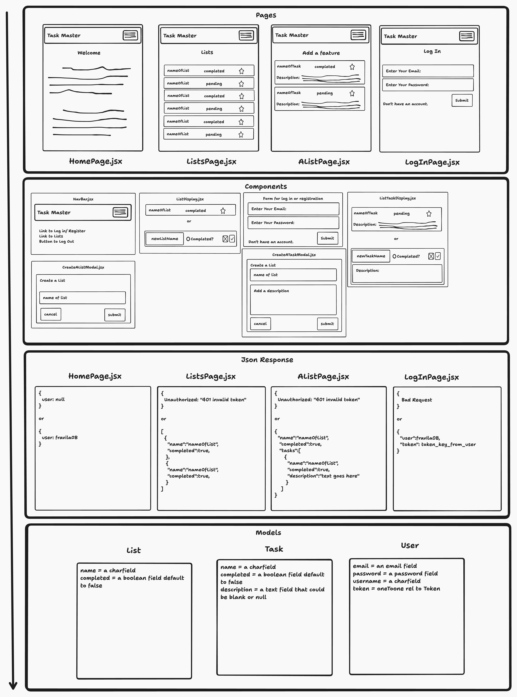

# How to Plan Your Full-Stack App

This is some informal advice on how to go about designing and planning a full-stack app.

1. Draw out pages for your frontend.
2. From pages identify components and their “reactions”
3. From pages identify what data I need in order to render my components within my page
4. From responses, identify Django model fields and how they would look within the db.

The diagram below is an example of drawing out the pages for the ToDo List fullstack app [from this project repo on the 'ready_to_deploy' branch](https://github.com/Code-Platoon-Curriculum/deployment-app/tree/ready_to_deploy)

